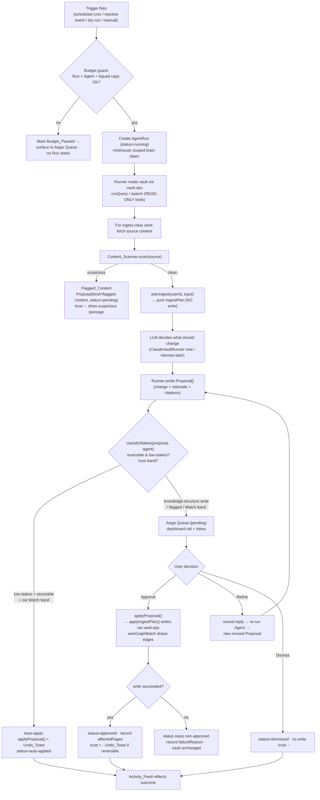
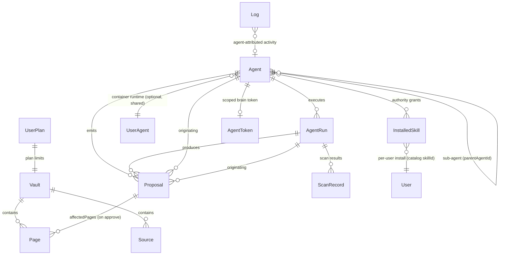

# Design Document — Hermes Agents OS

## Overview

Hermes Agents OS is the Pro-tier orchestration layer that turns SecondBrain's
existing single-agent plumbing into a supervised multi-agent system. The whole
design rests on one inviolable rule — the **Aegis Gate**: *agents propose, they
never write*. An Agent Run reads the vault through the existing `vault-ops`
functions, asks an LLM to decide what should change, and emits **Proposals**
instead of performing writes. A write to the vault happens in exactly one place:
when the user approves a Proposal (or a low-stakes, reversible action auto-applies
under Stakes Scaling) the system calls a single `applyProposal` path that performs
the real write through the same shared planner the Clerk UI uses.

This design is **strictly additive**. It does not change the behavior of any
existing surface:

- `vault-ops.ts` (`runQuery`, `runIngest`) stays the single source of truth for
  query/ingest. The existing direct callers — the Clerk UI routes and the
  token-authed `/api/agent/*` routes — keep working unchanged.
- `agent-service.ts` + `agent-provisioner.ts` stay the container control plane.
- `AgentToken`, `UserAgent`, `Vault`, `Page`, `Source`, `Log`, `UserPlan` keep
  their current fields. New behavior lands in **new** collections (`Agent`,
  `Proposal`, `AgentRun`, `InstalledSkill`) plus additive, optional fields.
- The skill `catalog.ts` stays the curated, code-defined registry; per-user
  install/scan/enable state lands in a new `InstalledSkill` DB record.

The central engineering move that makes "propose-never-write" possible without
forking ingest logic is a **refactor of the write-planning out of `runIngest`
into a pure planner** (`planIngest`) plus an `applyIngestPlan` that performs the
persistence. Both the existing direct path and the new agent/dry-run path call
the same planner, so the two paths can never diverge.

### Design goals and non-goals

| Goal | How the design meets it |
|---|---|
| No vault write without sign-off | Single `applyProposal` write choke point; runner is structurally incapable of writing |
| Identical logic for UI vs agent | Shared `planIngest`/`applyIngestPlan`; `vault-ops` reused as tools |
| Swap Claude-in-process → Hermes container later | `AgentRunner` driver interface; both drivers emit the same `Proposal[]` |
| Least privilege | `Agent.trustScope` + scoped token mint; sub-agent scope ⊆ parent |
| Trust earned, not asserted | `Agent.trustScore` 0–100, adjusted from real Run/Proposal outcomes |
| Untrusted content can't poison the brain | `Content_Scanner` runs in the read/ingest path before any Proposal is generated |
| Spend is bounded | Budget caps at Run / Agent / Squad levels checked before a Run starts |
| Calm, glass UI | Every surface uses the `.kiro/steering/glass-theme.md` recipe |

**Non-goals (this spec):** real always-on cron infrastructure (interim trigger
approach described in §2.4), the Hermes container runner implementation (interface
designed now, driver built later), and the design-system overhaul tracked
separately in `quiet-instrument-design-system`.

## Architecture

### Layered view

The agent layer sits *on top of* vault-ops and the control plane; it never
reaches around them.

```
┌──────────────────────────────────────────────────────────────────────┐
│  SURFACES (glass theme)                                                │
│  Squad Dashboard · Agent Builder · Work Board · Skills Library · Cost  │
└───────────────┬────────────────────────────────────────────────────────┘
                │ API routes (/api/agents, /api/proposals, /api/skills …) │
┌───────────────▼────────────────────────────────────────────────────────┐
│  HERMES ORCHESTRATION (new, additive)                                  │
│                                                                        │
│   AgentRunner (driver)        Aegis layer            Trust engine      │
│   ├ ClaudeVaultRunner (now)   ├ classifyStakes()     ├ adjustTrust()   │
│   └ HermesContainerRunner     ├ applyProposal()      └ band()          │
│      (later, same iface)      └ refineProposal()                       │
│                                                                        │
│   Content_Scanner.scan()      Budget guard (3 levels)                  │
│   Scheduler (trigger eval)    planIngest / applyIngestPlan (shared)    │
└───────────────┬────────────────────────────────────────────────────────┘
                │ calls as "tools" (read) + shared planner (write-on-approve)
┌───────────────▼────────────────────────────────────────────────────────┐
│  vault-ops.ts  — runQuery · runIngest · planIngest · applyIngestPlan   │
│  claude.ts · auto-link.ts (wireGraphBatch) · models.ts                 │
└───────────────┬────────────────────────────────────────────────────────┘
                │
┌───────────────▼───────────────┐   ┌────────────────────────────────────┐
│  CONTROL PLANE (reused)        │   │  EXISTING SURFACES (unchanged)     │
│  agent-service.ts              │   │  Clerk UI → runIngest/runQuery     │
│  agent-provisioner.ts          │   │  /api/agent/* → runIngest/runQuery │
│  (Docker / Null drivers)       │   │  /api/agent-instance/*             │
└────────────────────────────────┘   └────────────────────────────────────┘
```

### The propose-never-write data flow

This is the spine of the system. A Run never mutates the vault; the only write
path is `applyProposal → applyIngestPlan`.



The key structural property: **the runner has no write capability at all.** It is
handed read-only tool bindings (`runQuery`, `search`) plus the pure `planIngest`.
It cannot call `applyIngestPlan`. Only the Aegis layer (`applyProposal`) can, and
only on an approved/auto-applied Proposal. This makes Requirement 2.10 — "no vault
write except as the direct result of an approved Proposal or auto-applied
low-stakes action" — an architectural invariant rather than a convention.

### Refactoring `runIngest` (the critical change)

`runIngest` today does two things in one function: it **plans** (calls the LLM to
generate pages/entities and decides what the writes should be) and it **persists**
(creates `Page`/`Source` docs, runs `wireGraphBatch`, bumps `Vault` counts, writes
a `Log`). To support propose-never-write *without changing existing callers*, we
split it into a pure planner and an applier, then re-express `runIngest` in terms
of both:

```ts
// vault-ops.ts — NEW pure planner (no DB writes, no LLM token side effects on UserPlan)
export type IngestPlan = {
  source: { type: 'url' | 'text'; title: string; url: string | null
            rawContent: string; wordCount: number }
  // What WOULD be written, fully resolved against the current vault:
  pageOps: Array<
    | { op: 'create'; slug: string; title: string; type: PageType
        content: string; summary: string; relatedSlugs: string[]
        tags: string[]; confidence: 'high'|'medium'|'low' }
    | { op: 'update'; slug: string; mergedContent: string; summary?: string
        addSources: true; addTags: string[]; addRelated: string[] }
  >
  entityOps: Array<{ op: 'create'|'update'; slug: string; /* …same shape… */ }>
  expectedGraphSlugs: string[]        // slugs fed to wireGraphBatch on apply
  tokensUsed: number                  // planning-phase LLM tokens
  ingestedAt: string
}

/** PURE-ish: runs the LLM + reads the vault to compute what WOULD be written.
 *  Performs NO Page/Source/Vault/Log writes. Safe for dry-runs and agents. */
export async function planIngest(userId: string, input: IngestInput): Promise<IngestPlan>

/** Persists a previously-computed plan. The ONLY ingest write path. Atomic-ish
 *  (see Error Handling): on failure it does not leave a half-written vault. */
export async function applyIngestPlan(
  userId: string,
  plan: IngestPlan,
  opts?: { logActor?: { agentId: string; runId: string } }   // attributes the Log to an agent
): Promise<IngestResult>

/** UNCHANGED PUBLIC CONTRACT — existing Clerk UI + /api/agent/ingest keep calling this.
 *  Now implemented as: const plan = await planIngest(...); return applyIngestPlan(...). */
export async function runIngest(userId: string, input: IngestInput): Promise<IngestResult>
```

- **Existing direct path (Clerk UI, `/api/agent/ingest`)** keeps calling
  `runIngest(userId, input)` — its signature and `IngestResult` are unchanged, so
  no caller is touched (Req 11.1, 11.2).
- **Agent / dry-run path** calls `planIngest` only, wraps the resulting
  `IngestPlan` in a `Proposal`, and never persists. On approval, `applyProposal`
  calls `applyIngestPlan(userId, plan, { logActor })`.
- `runQuery` is read-only already (it writes only a `Log` row + a usage counter,
  not knowledge), so agents may call it directly as a read tool. The runner uses a
  thin read-only wrapper that suppresses the usage-counter increment when running
  in dry-run mode (the counter increment is acceptable for real runs; see §4).

> We considered option (b) — wrapping `runIngest` behind a proposal-capture shim
> that records intended writes by intercepting Mongoose calls. Rejected: it would
> require mocking/trapping the persistence layer, is brittle, and leaves the two
> code paths able to drift. Option (a) — extract a real planner — is explicit,
> testable in isolation (the planner is where the PBT value is), and guarantees the
> dry/agent path and the live path share identical logic.

## Components and Interfaces

### 1. The runner engine (`src/lib/agents/runner/`)

A **driver-abstracted** engine mirroring the `AgentProvisioner` pattern already in
the codebase. One interface, two drivers; both always emit `Proposal[]` and never
write.

```ts
// src/lib/agents/runner/types.ts
export type RunTrigger =
  | { kind: 'manual' }
  | { kind: 'dry-run' }
  | { kind: 'scheduled'; cron: string }
  | { kind: 'reactive'; event: string; sourceAgentId?: string }

export type RunContext = {
  agent: AgentDoc            // configured worker (role, skills, scope, signOffPolicy, trust)
  trigger: RunTrigger
  runId: string             // AgentRun._id, created before the run starts
  parentRunId?: string      // set for sub-agent runs
  scopedToken: string       // brain token scoped to agent.trustScope (never logged)
  budget: ResolvedBudget    // effective per-run cap after Agent/Squad clamps
  dryRun: boolean
}

export type RunOutput = {
  proposals: DraftProposal[]   // emitted, NOT yet persisted as approved
  scanResults: ScanResult[]
  tokensUsed: number
  trace: RunTraceEntry[]       // skills invoked, tokens per step
  outcome: 'completed' | 'failed' | 'budget-stopped' | 'timeout'
  failureReason?: string
}

export interface AgentRunner {
  /** Execute one Run. MUST NOT write knowledge to the vault. Emits Proposals. */
  run(ctx: RunContext, tools: VaultTools): Promise<RunOutput>
}

// Read-only tool bindings handed to the runner. Note: NO applyIngestPlan here.
export type VaultTools = {
  search(query: string): Promise<SearchHit[]>            // raw retrieval (read)
  query(question: string): Promise<QueryResult>          // runQuery (read)
  planIngest(input: IngestInput): Promise<IngestPlan>    // PURE plan, no write
  fetchSource(input: IngestInput): Promise<RawSource>    // fetch + clean only
  scan(source: RawSource): ScanResult                    // Content_Scanner
}
```

```ts
// src/lib/agents/runner/claude-vault-runner.ts  (execution model B — NOW)
export class ClaudeVaultRunner implements AgentRunner { run(ctx, tools) { … } }

// src/lib/agents/runner/hermes-container-runner.ts  (LATER — same interface)
// Delegates the run into the user's sandboxed Hermes container via /api/agent/*,
// then collects the emitted proposals back. Plugs in behind the same Proposal
// interface; the Aegis layer downstream is identical.
export class HermesContainerRunner implements AgentRunner { run(ctx, tools) { … } }

// src/lib/agents/runner/index.ts
export function getRunner(): AgentRunner {
  const driver = process.env.AGENT_RUNNER || 'claude'
  return driver === 'hermes' ? new HermesContainerRunner() : new ClaudeVaultRunner()
}
```

`ClaudeVaultRunner` flow: build the system prompt from the Agent's role +
assigned skill `promptTemplate`s (interpolating the objective) → call Claude with
the read tools → for any ingest-class intent, `fetchSource` → `scan` →
`planIngest` → convert each plan into a `DraftProposal` carrying the plan, a
rationale, and citations. It accumulates a `RunTrace` (skills invoked, tokens per
step) and stops when `tokensUsed` would exceed `ctx.budget.perRunTokens`.

#### 2.4 Triggers and scheduling

Two trigger classes from Req 1.4–1.6:

- **Scheduled** — `Agent.schedule = { kind: 'scheduled', cron }`. Evaluated by a
  `Scheduler.tick()` function that finds Agents whose cron is due and are in a
  runnable lifecycle state (not paused/retired/budget-paused) and enqueues Runs.
- **Reactive** — `Agent.schedule = { kind: 'reactive', event, sourceAgentId? }`.
  When a Run completes, the system emits a domain event (e.g.
  `agent.run.completed`, `proposal.approved`, `vault.page.created`); the Scheduler
  matches reactive Agents to the event and chains the next Run. When the trigger
  references another Agent's output (Req 1.6), the triggered Run starts only after
  the source Agent's Run reaches a terminal state.

> **Infra flag (honest):** always-on scheduling needs a real worker/cron — Next.js
> route handlers are request-scoped and won't fire timers reliably. The design
> isolates this behind `Scheduler.tick()` so the trigger-matching *logic* is pure
> and unit/property-testable now. **Interim (this build):** `tick()` is invoked by
> (a) a protected `/api/agents/scheduler/tick` route called by an external cron
> (Vercel Cron / a host cron hitting the endpoint), and (b) opportunistically after
> any Run completes (covers reactive chaining immediately). A dedicated long-lived
> worker is a later infrastructure task, not a code change to the orchestration
> layer. We will NOT run a blocking in-process timer.

### 2. Aegis layer (`src/lib/agents/aegis/`)

```ts
// Pure classifier — total & deterministic (PBT target).
export type Stakes = 'low-reversible' | 'sign-off-required'
export function classifyStakes(p: DraftProposal, agent: AgentDoc): Stakes

// The ONE write choke point. Performs the real write on approve/auto-apply.
export async function applyProposal(proposalId: string, actor: ActorRef): Promise<Proposal>

// Refine: record the user's reply, re-run the agent, emit a revised Proposal.
export async function refineProposal(proposalId: string, reply: string): Promise<Proposal>

// Dismiss: status=dismissed, no write, negative trust input.
export async function dismissProposal(proposalId: string, actor: ActorRef): Promise<Proposal>

// Undo a reversible action within its window (auto-applied OR approved).
export async function undoProposal(proposalId: string): Promise<Proposal>
```

`applyProposal` is the only function in the codebase (besides the unchanged direct
`runIngest`) that calls `applyIngestPlan`. It:
1. Loads the `Proposal`; rejects unless status ∈ {pending, auto-applying}.
2. Calls `applyIngestPlan(userId, proposal.plan, { logActor })`.
3. On success → `status=approved`, store `affectedPages`, post `Undo_Toast` if
   reversible, feed positive trust input.
4. On failure → status unchanged (stays pending/failed), store `failureReason`,
   **no partial vault mutation** (Req 2.8).

### 3. Content Scanner (`src/lib/agents/scanner.ts`)

```ts
export type ScanCategory = 'injection' | 'credential' | 'pii' | 'addressed-to-ai'
export type ScanFinding = { category: ScanCategory; passage: string; offset: number }
export type ScanResult =
  | { status: 'clean'; findings: [] }
  | { status: 'flagged'; findings: ScanFinding[] }   // non-empty

/** Pure, synchronous, deterministic pattern scan. No I/O. PBT target. */
export function scanContent(text: string): ScanResult
```

Sits in the read/ingest path **before** Proposal generation (Req 5.1, 5.9): the
runner calls `scan(source)` immediately after `fetchSource` and before
`planIngest`. A `flagged` result short-circuits planning and produces a
`Proposal(kind='flagged-content', status='pending')` that carries the suspicious
passages for display (Req 5.4, 5.5); it is never silently ingested or silently
discarded (Req 5.6, 5.7) and it decreases the Agent's trust (Req 4.8).

### 4. Trust engine (`src/lib/agents/trust.ts`)

```ts
export type TrustBand = 'trusted' | 'proving' | 'watch'
export type TrustEvent =
  | 'proposal-approved-clean' | 'dry-run-clean' | 'in-scope-run'
  | 'proposal-dismissed' | 'proposal-heavily-refined'
  | 'scope-violation' | 'injection-detected'

/** Clamps result to [0,100] (Req 4.12). Pure. PBT target. */
export function adjustTrust(score: number, event: TrustEvent): number
export function band(score: number): TrustBand   // 80-100 trusted, 40-79 proving, 0-39 watch
```

### 5. Budget guard (`src/lib/agents/budget.ts`)

```ts
export type ResolvedBudget = { perRunTokens: number; agentRemaining: number; squadRemaining: number }
/** Pure pre-flight check. Returns whether a Run may start and the effective cap. */
export function canStartRun(b: BudgetInputs): { allowed: boolean; effective: ResolvedBudget; reason?: string }
/** Pure bar-state classifier for the per-run budget bar. */
export function budgetBarState(used: number, cap: number): 'ok' | 'amber' | 'over'   // ≥80% amber, ≥100% over
```

### 6. Skills (`src/lib/skills/`)

`catalog.ts` stays the curated **Discover registry** (code-defined). A new
`InstalledSkill` DB record tracks per-user install/scan-status/enabled plus the
Skill's security metadata. A new `scanSkill()` performs the blocking
`Security_Scan` at install and on periodic re-scan.

```ts
// src/lib/skills/security-scan.ts
export type SkillScanResult =
  | { status: 'passed' }
  | { status: 'failed'; reasons: Array<'injection'|'credential-access'|'exfiltration'|'capability-mismatch'> }
/** Verifies no injection / no credential access / no exfiltration and that the
 *  declared `touches` matches observed behavior (Req 9.3, 9.9). */
export function scanSkill(def: SkillDef): SkillScanResult
```

## Data Models

All new collections follow the existing `models.ts` conventions (Mongoose schema,
`{ timestamps: true }`, hot-reload-safe export, `userId` string index). Existing
models are **extended only with optional fields** so current features are
unaffected (Req 11.8).

### Model relationship diagram



### `Agent` (NEW collection)

The configured worker. A **new collection** that supersedes `UserAgent` for the
multi-agent model; `UserAgent` stays as the single container-runtime record (one
per user) that an `Agent` references when (later) executed via the Hermes
container. This avoids overloading the single-per-user `UserAgent` while reusing
it for what it already models.

```ts
interface IAgent {
  userId: string                       // Clerk user (indexed)
  name: string
  role: 'scout'|'synthesist'|'connector'|'critic'|'librarian'|'researcher'|'custom'
  customRoleDescription: string | null // when role==='custom'

  // Schedule (Req 1.4–1.6)
  schedule:
    | { kind: 'scheduled'; cron: string }
    | { kind: 'reactive'; event: string; sourceAgentId: string | null }
    | { kind: 'manual' }

  // Skills assigned (Authority_Grants) — refs to InstalledSkill (Req 9.7)
  assignedSkillIds: string[]           // InstalledSkill._id values

  // Sign-off policy (Req 1.1, 7) — per action type: auto vs ask-first
  signOffPolicy: {
    ingestSource: 'auto' | 'ask'
    createSynthesis: 'auto' | 'ask'
    createConnection: 'auto' | 'ask'
    flagContradiction: 'auto' | 'ask' | 'notify'
  }

  // Trust scope (least privilege, Req 1.7, 1.8)
  trustScope: {
    readableSourceIds: mongoose.Types.ObjectId[]   // empty = whole vault per policy
    readableCollections: string[]
    webAccess: boolean
    perRunTokenBudget: number
  }
  trustScopeStatement: string          // generated plain-language incl. "cannot" list

  // Trust (Req 4) — earned, not a setting
  trustScore: number                   // 0..100, default in Watch/Proving band
  // Budget (Req 10.4) — per-agent cap level
  budget: { period: 'weekly'|'monthly'; tokenCap: number; tokensThisPeriod: number; periodStart: Date }

  // Lifecycle (Req 1.9–1.13)
  lifecycle: 'describe'|'preview'|'dry-run'|'deploy'|'monitor'|'pause'|'retire'
  hadSuccessfulDryRun: boolean         // gates deploy (Req 7.10)
  budgetPaused: boolean                // Req 10.6

  // Sub-agent (Req 8.9–8.11)
  parentAgentId: mongoose.Types.ObjectId | null

  // Runtime linkage (reuse, Req 1.14)
  userAgentId: string | null           // → UserAgent (container) when hermes runner
  tokenId: string | null               // → AgentToken scoped to trustScope (Req 11.6)
  createdAt: Date; updatedAt: Date
}
```

### `Proposal` (NEW collection)

The unit of propose-never-write. Carries everything the Aegis Queue renders
(what · why · decision) and the resolved write plan to apply on approval.

```ts
interface IProposal {
  userId: string                       // indexed
  agentId: mongoose.Types.ObjectId     // originating Agent (Req 2.3)
  runId: mongoose.Types.ObjectId       // originating AgentRun (Req 2.3)
  parentProposalId: mongoose.Types.ObjectId | null   // for refine lineage

  kind: 'ingest'|'synthesis'|'connection'|'flagged-content'
  title: string                        // "what is proposed" (human register)
  rationale: string                    // "why" (Req 2.3)
  citations: Array<{ slug?: string; url?: string; quote: string }>  // ≥1 for factual (Req 2.5)

  // The resolved write to perform on approval (null for flagged-content holds):
  plan: IngestPlan | ConnectionPlan | null

  // Stakes + status (Req 2.4, 3.3, Stakes_Scaling)
  stakes: 'low-reversible' | 'sign-off-required'
  status: 'pending'|'approved'|'refined'|'dismissed'|'auto-applied'|'failed'

  // Scanner linkage (Req 5)
  scanResult: ScanResult | null        // present + flagged for kind==='flagged-content'

  // Outcome bookkeeping
  affectedPages: string[]              // slugs written on approve (Req 2.7)
  failureReason: string | null         // Req 2.8
  undo: { reversible: boolean; expiresAt: Date | null; undonePages?: string[] } | null  // Req 3.7,3.8
  decidedBy: string | null; decidedAt: Date | null
  createdAt: Date; updatedAt: Date
}
```

`ConnectionPlan` is a small sibling of `IngestPlan` describing graph edges to draw
(`relatedSlugs` additions) so non-ingest writes also flow through one applier.

### `AgentRun` (NEW collection)

One execution. Holds the trace and the cost/outcome that feed trust + budget.

```ts
interface IAgentRun {
  userId: string                       // indexed
  agentId: mongoose.Types.ObjectId
  parentRunId: mongoose.Types.ObjectId | null   // sub-agent run
  trigger: 'manual'|'dry-run'|'scheduled'|'reactive'
  dryRun: boolean

  status: 'running'|'completed'|'failed'|'budget-stopped'|'timeout'
  outcome: string | null               // human summary
  failureReason: string | null

  // Run_Trace (Req 10.1, 10.11) — retained even for failed/stopped runs
  trace: Array<{ at: Date; skillId: string | null; step: string; tokens: number }>
  tokensUsed: number
  perRunBudget: number

  proposalIds: mongoose.Types.ObjectId[]
  scopeViolations: number              // feeds trust (Req 4.7)
  carryOver: { pending: boolean; note: string | null }   // Req 10.5
  startedAt: Date; finishedAt: Date | null
  createdAt: Date; updatedAt: Date
}
```

### `InstalledSkill` (NEW collection)

Reconciles "catalog is code" with the install/scan/enable lifecycle: the catalog
is the Discover registry; this record is the per-user Installed state.

```ts
interface IInstalledSkill {
  userId: string                       // indexed; unique with skillId
  skillId: string                      // → SKILLS[].id in catalog.ts (Discover registry)
  installedVersion: string             // Skill.version at install time

  // Capability_Grant state (Req 9.5, 9.6) — install ≠ authority
  enabled: boolean                     // Req 9.8, 9.12 — disabled blocks Authority_Grant + invocation

  // Security_Scan state (Req 9.3, 9.10, 9.11)
  scanStatus: 'passed'|'failed'|'pending'
  scanReasons: string[]                // failure reasons when failed
  lastScannedAt: Date | null
  autoDisabledByScan: boolean          // Req 9.11

  createdAt: Date; updatedAt: Date
}
```

### `Skill` model extensions (in `catalog.ts` `SkillDef`)

Additive fields on the existing code-defined `SkillDef`. `category` already exists
and serves as the capability category (Req 9.2).

```ts
interface SkillDef {
  // … existing fields (id, name, tagline, description, category, icon, accent,
  //    objectiveLabel, objectivePlaceholder, tools, schedules, writesToVault,
  //    promptTemplate, exampleOutcomes) …

  version: string                      // NEW — versioned/installable (Req 9, glossary "Skill")
  touches: Array<'vault-read'|'vault-write'|'network'|'credentials'|'nothing'>  // NEW — blast radius (Req 9.2, 9.9)
  scanned: { status: 'passed'|'failed'|'pending'; lastScannedAt: string | null } // NEW — baseline scanned status badge (Req 9.2)
}
```

### Existing-model extensions (additive, optional only)

- **`UserAgent`** — add optional `runnerDriver?: 'claude'|'hermes'` (default behavior
  unchanged when absent). Its existing fields and single-per-user semantics are
  untouched; `Agent.userAgentId` references it for the container runner.
- **`AgentToken`** — no field change; the `scopes` array is reused, and the new
  Agent-scoped mint stores the `Agent.trustScope`-derived scopes (Req 11.6). (If a
  future per-token scope object is needed it is added as an optional field, not a
  change to `scopes`.)
- **`Log`** — add optional `agentId?: ObjectId` and widen the `operation` enum
  additively (e.g. add `'agent'`) so agent activity feeds the Activity_Feed without
  changing existing `'ingest'|'query'|'lint'` rows. `applyIngestPlan`'s
  `logActor` writes this attribution.

`Vault`, `Page`, `Source`, `UserPlan` are unchanged.

### Trust score storage + adjustment

`trustScore` lives on `Agent` as an integer initialized into the Watch/Proving
band (Req 4.2). Every decision and run outcome routes through `adjustTrust`, whose
result is clamped to `[0,100]` (Req 4.12). `band()` derives the named band for the
UI and for the Watch-band override that forces sign-off (Req 4.11). Adjustment
inputs are recorded as `TrustEvent`s sourced from: Proposal approve/dismiss/refine
(Aegis layer), clean/violating dry-runs and in-scope runs (`AgentRun`), and
scanner injection detections (Content_Scanner).

### Budget fields at three levels (Req 10.4)

- **Per-Run:** `AgentRun.perRunBudget` (resolved from `Agent.trustScope.perRunTokenBudget`, clamped by remaining Agent/Squad caps).
- **Per-Agent:** `Agent.budget { period, tokenCap, tokensThisPeriod, periodStart }`.
- **Squad-level:** a single `SquadBudget` record per user (small new collection or
  a field on `UserPlan` — recommend a dedicated `SquadBudget { userId, monthlyTokenCap, tokensThisPeriod, periodStart }` to keep `UserPlan` untouched).

## Correctness Properties

*A property is a characteristic or behavior that should hold true across all valid
executions of a system — essentially, a formal statement about what the system
should do. Properties serve as the bridge between human-readable specifications
and machine-verifiable correctness guarantees.*

PBT **is appropriate** for this feature because its safety core
is pure logic over a large input space: the stakes classifier, trust adjustment,
scope-subset resolution, budget math, the content scanner, lifecycle transitions,
and the planner/applier split. These are deterministic functions with universal
properties (invariants, round-trips, totality, monotonicity). The UI surfaces,
container wiring, and `/api/agent/*` preservation are covered by example,
component, and integration tests instead (see Testing Strategy).

The prework consolidated ~90 acceptance criteria into the following non-redundant
properties. Each is implemented by a single `fast-check` property test.

### Property 1: Propose-never-write (the core safety invariant)

*For any* Agent (including sub-agents) and *any* Run — scheduled, reactive,
manual, or dry-run — executed against an instrumented vault, the number of
knowledge writes performed by the runner is zero; every intended alteration
appears only as a `Proposal`, and a vault knowledge write occurs **only** as the
direct result of `applyProposal` on an approved Proposal or an auto-applied
low-stakes reversible action.

**Validates: Requirements 2.2, 2.10, 5.6, 7.8, 8.11**

### Property 2: Stakes classifier is total, correct, and trust-monotone

*For any* `DraftProposal` and *any* Agent, `classifyStakes` returns exactly one of
`low-reversible` or `sign-off-required`; it returns `sign-off-required` whenever
the proposal writes knowledge structure and is not a reversible low-stakes action
or involves Flagged_Content; it returns `sign-off-required` for **every**
knowledge-altering proposal when the Agent is in the Watch band regardless of
sign-off policy; and raising the Agent's trust band never shrinks the set of
actions that may auto-apply.

**Validates: Requirements 3.4, 3.5, 4.10, 4.11**

### Property 3: Trust adjustment moves in the correct direction

*For any* trust score and *any* `TrustEvent`, a positive event
(approve-clean, clean dry-run, in-scope run) never decreases the score, a negative
event (dismiss, heavy refine, scope violation, injection detected) never increases
it, and a dry-run that involved a scope violation never increases the score.

**Validates: Requirements 3.9, 4.3, 4.4, 4.5, 4.6, 4.7, 4.8**

### Property 4: Trust score stays an integer in [0,100] with correct bands

*For any* integer starting score and *any* sequence of `TrustEvent`s, every
resulting `trustScore` is an integer in `[0,100]`; a newly created Agent's score
is below 80 (Watch or Proving); and `band(score)` returns `trusted` for 80–100,
`proving` for 40–79, and `watch` for 0–39 with no gaps or overlaps at the
boundaries.

**Validates: Requirements 4.1, 4.2, 4.9, 4.12**

### Property 5: Content scanner flags any detectable pattern and never drops content

*For any* text containing an embedded AI-addressed instruction, credential
pattern, or PII pattern, `scanContent` returns `status='flagged'` with at least one
finding whose `passage` is a substring of the input and whose `category` matches
the detected class; *for any* text containing none of these, it returns
`status='clean'`, permitting the source to proceed to Proposal generation; and
every flagged scan yields exactly one persisted holding Proposal (none silently
discarded).

**Validates: Requirements 5.2, 5.3, 5.4, 5.5, 5.7, 5.8**

### Property 6: Apply-then-undo restores the prior vault state (round-trip)

*For any* reversible Proposal, applying it via `applyProposal` and then calling
`undoProposal` within the undo window restores the vault to a state equivalent to
its pre-apply state, whether the action was auto-applied or manually approved.

**Validates: Requirements 3.7, 3.8**

### Property 7: Failed apply leaves the vault unchanged (atomicity)

*For any* `IngestPlan` whose `applyIngestPlan` fails at any step, the post-failure
vault state equals the pre-apply vault state, and the originating Proposal's status
is not `approved` and carries a non-empty `failureReason`.

**Validates: Requirements 2.8**

### Property 8: Sub-agent and token scope never exceed the parent/agent scope (subset)

*For any* parent Trust_Scope and *any* requested sub-agent scope, the resolved
sub-agent scope is a subset of the parent scope (readable sources/collections ⊆
parent's, `webAccess` ⇒ parent had `webAccess`, `perRunTokenBudget` ≤ parent's);
and *for any* Agent, the brain token minted for it grants scopes derived from —
and never broader than — its Trust_Scope.

**Validates: Requirements 8.10, 11.6**

### Property 9: A run never starts that would exceed any budget cap

*For any* combination of per-Run, per-Agent, and Squad budget state,
`canStartRun` returns `allowed=false` when the Agent is Budget_Paused, when the
per-Agent cap is reached, or when the Squad master cap is reached; and the
`effective` per-Run budget it returns never exceeds the smallest remaining cap
across the three levels.

**Validates: Requirements 10.4, 10.6, 10.7, 10.8**

### Property 10: Per-run budget bar state is a total function of usage

*For any* non-negative `used` and positive `cap`, `budgetBarState` returns `ok`
below 80% of cap, `amber` in `[80%, 100%)`, and `over` at or above `cap`.

**Validates: Requirements 10.9, 10.10**

### Property 11: A disabled skill is never grantable and never invokable

*For any* `InstalledSkill` with `enabled=false`, an Authority_Grant assigning it to
an Agent is rejected, and *for any* Agent Run the set of invoked skills excludes
every disabled skill.

**Validates: Requirements 9.8, 9.12**

### Property 12: Security scan gates installation and grants no authority

*For any* `SkillDef`, `scanSkill` returns `failed` if and only if it exhibits
injection, credential access, or exfiltration, or its declared `touches` does not
match its observed behavior (including `touches: nothing` with network/credential
access); a failing scan never produces an enabled `InstalledSkill`; and a passing
scan creates a Capability_Grant only — no Agent gains authority to the skill as a
side effect of installation.

**Validates: Requirements 9.3, 9.4, 9.5, 9.6, 9.9**

### Property 13: A failing re-scan auto-disables the skill and surfaces it

*For any* installed Skill whose periodic re-scan fails, the Skill's `enabled`
becomes `false` and a corresponding item is created in the Aegis Queue.

**Validates: Requirements 9.11**

### Property 14: Lifecycle transitions are total, gated, and never schedule a halted agent

*For any* Agent lifecycle state and *any* transition event, the transition function
returns a valid lifecycle state (never an illegal/undefined state); a transition to
`deploy` is permitted only when the Agent has had at least one successful Dry_Run;
and *for any* Agent whose state is `pause`, `retire`, or whose `budgetPaused` is
true, the Scheduler starts no scheduled or reactive Run (reactive matching returns
only runnable agents whose trigger event matches).

**Validates: Requirements 1.9, 1.13, 7.10, 10.7, 1.5**

### Property 15: Every emitted Proposal is well-formed and cites its facts

*For any* Proposal emitted by a Run, it carries a non-null change/plan reference
(or scan result for flagged-content), a rationale, an originating `agentId` and
`runId`, and a status from the valid enum; every factual Proposal
(ingest/synthesis/connection) has at least one citation; and every newly emitted
sign-off-required Proposal has status `pending`.

**Validates: Requirements 2.3, 2.4, 2.5**

### Property 16: Aegis Queue items have consistent anatomy and resolve cleanly

*For any* pending Proposal, its queue/work-item view model exposes what is proposed
(title), why (rationale plus at least one citation for factual items), and exactly
the three decision actions Approve / Refine / Dismiss; and *for any* Proposal moved
to a terminal status, it is absent from the pending queue and its outcome appears
in the Activity_Feed.

**Validates: Requirements 3.2, 3.3, 3.11, 8.7**

### Property 17: The warm accent is reserved for the review state only

*For any* Agent status and *any* Work_Board column, the warm accent treatment is
applied if and only if the status is the awaiting-sign-off/review state (or the
Review column); `live`, `idle`, `paused`, `error` states and the four non-review
columns never receive the accent.

**Validates: Requirements 6.5, 6.6, 6.7, 8.3**

### Property 18: Token attribution is conserved

*For any* set of `AgentRun` traces, the sum of tokens attributed across Agents and
the sum attributed across Skills each equal the grand total of tokens consumed —
no tokens are lost or double-counted.

**Validates: Requirements 10.2**

### Property 19: Dashboard counts equal the true tallies (no fabricated data)

*For any* set of Agents, Proposals, and today's Log rows, the status-strip counts
(running / scheduled / awaiting-sign-off) and the "today" proof-of-work counts
(sources ingested / connections made / syntheses proposed) equal the actual
tallies derived from the underlying records.

**Validates: Requirements 6.1, 6.2**

### Property 20: Secrets are never present in emitted log output

*For any* brain token or BYO LLM key value, the agent layer's log/redaction
function produces output that does not contain the secret as a substring.

**Validates: Requirements 11.4**

### Property 21: Role defaults are conservative and scope statements deny by name

*For any* Agent_Role, the generated default skill set is well-formed and the default
Sign_Off_Policy sets every knowledge-write action to `ask` (conservative by
default); and *for any* Trust_Scope, the generated Trust_Scope_Statement includes
each granted capability and a non-empty explicit "cannot" list.

**Validates: Requirements 1.3, 1.8**

### Property 22: Builder preview merge is field-precise; ambiguity asks exactly one question; dry-run counts are accurate

*For any* preview state and *any* partial update parsed from conversation,
`mergePreview` changes only the fields explicitly stated and preserves all others;
*for any* parsed intent with one or more ambiguous required fields, the builder
emits exactly one clarifying question; and *for any* Dry_Run output, the summary
counts (would-ingest / filtered / would-propose) equal the tallies of the run's
proposals and filtered sources.

**Validates: Requirements 7.3, 7.4, 7.7**

## Error Handling

| Failure | Detection | Handling | Requirement |
|---|---|---|---|
| **Partial write on approve** | `applyIngestPlan` throws mid-persist | Order writes so the `Source` + all `Page` ops run, then `wireGraphBatch`, then `Vault`/`Log`; on any throw, do **not** mark the Proposal approved, record `failureReason`, and leave the vault in its pre-apply state. Where Mongo lacks a single transaction across these (replica-set dependent), the applier records an idempotency key on the Proposal and re-deriving from the stored `IngestPlan` makes a retry safe (create ops are slug-keyed upserts). The property test (P7) asserts the no-partial-change invariant via injected failures. | 2.8 |
| **Runner fails mid-run** | exception / non-terminal stop | Mark `AgentRun.status='failed'`, persist the partial `trace` (Req 10.11), set `carryOver.pending=true` so the next Run resumes the objective (Req 10.5); emit no Proposals from the failed step. Trust receives no positive input for a failed run. | 10.5, 10.11 |
| **Scanner false positive** | user reviews Flagged_Content and approves | Flagged content is *held, not blocked* — the suspicious passage is shown and the user can approve through the Aegis Queue, after which the held content proceeds via `applyIngestPlan`. A user approval of flagged content is logged but, because the flag was the scanner's call, it does not penalize the Agent's trust. | 5.4, 5.5, 5.6 |
| **Budget exhausted mid-run** | per-run token meter crosses cap during the run | The run is allowed to finish its in-flight reporting step then stops with `outcome='budget-stopped'`; the bar renders `over` (P10); unfinished work carries over (Req 10.5). Reaching the per-Agent cap sets `budgetPaused=true` and surfaces to the queue (Req 10.6); the Squad cap blocks all new runs (Req 10.8). | 10.5, 10.6, 10.8 |
| **Container vs in-process runner differences** | driver selection | Both drivers implement `AgentRunner` and emit `Proposal[]` through the identical Aegis path, so downstream behavior is driver-independent. `ClaudeVaultRunner` failures surface as exceptions; `HermesContainerRunner` failures additionally include container/transport errors mapped to `AgentRun.failureReason` and reconciled via the existing `getProvisioner().status()` check. The BYO key never leaves the container env (Req 11.5) and is never logged (Req 11.4, P20). | 2.11, 11.4, 11.5 |
| **Scope violation attempt** | runner requests a source/collection outside `trustScope` | The read is denied (scoped token + in-process scope check), `AgentRun.scopeViolations` increments, trust decreases (Req 4.7), and the event is recorded; the run continues within scope. | 4.7 |
| **Existing `VaultOpError`** | thrown by `runQuery`/`runIngest`/`planIngest` | Preserved and surfaced unchanged through the existing routes; the agent path maps it to a failed Proposal/Run without altering current error contracts. | 11.2 |

## Testing Strategy

### Dual approach

- **Property-based tests (fast-check, ≥100 iterations each)** verify the pure
  logic where input variation reveals bugs — Properties 1–22 above. `fast-check`
  is already a dev dependency (v4.8.0) and used across the codebase, with vitest
  (`npm test`).
- **Example / component / integration tests** verify specific behaviors, DOM/ARIA,
  glass-theme conformance, and the write/wiring paths.

### Property tests

- One property test per correctness property; each runs `{ numRuns: 100 }` minimum.
- Each test is tagged with a comment referencing this design, format:
  `// Feature: hermes-agents, Property {N}: {property text}`.
- Pure targets (no I/O), tested directly: `classifyStakes` (P2), `adjustTrust` +
  `band` (P3, P4), `scanContent` (P5), `resolveSubScope` + token-scope mapping
  (P8), `canStartRun` (P9), `budgetBarState` (P10), `scanSkill` (P12), lifecycle
  `transition` + scheduler matching (P14), role defaults + scope statement (P21),
  `mergePreview` + clarifying-question selector (P22), the log redactor (P20),
  attribution sums (P18), status/proof-of-work tallies (P19), status/column accent
  mapping (P17).
- Safety/round-trip targets tested against an **in-memory / spy vault** so 100+
  iterations stay cheap and the LLM is stubbed with deterministic plan fixtures:
  P1 (zero writes from the runner), P6 (apply/undo round-trip), P7 (atomic
  failure), P11 (disabled skill never invoked), P15/P16 (proposal well-formedness +
  queue anatomy). The LLM call inside `planIngest` is mocked so the property
  exercises *our* plan→proposal→apply logic, not Claude.

### Example, component, and integration tests

- **Integration (against a test MongoDB, `npm run test:integration`):**
  `applyProposal` → `applyIngestPlan` creates pages and draws edges (Req 2.6, 2.7);
  refine produces a child Proposal (Req 3.6, 8.8); dry-run writes nothing end-to-end
  (Req 7.6); scanner ordering before planning (Req 5.1, 5.9); scheduled/reactive
  activation (Req 1.4, 1.6, 7.11); periodic re-scan (Req 9.10).
- **Component (jsdom):** glass-theme recipe present on every surface — `sb-dashboard`
  shell + `dash-panel dash-grain dash-interactive` panels, portal overlays using
  root tokens (Req 6.10, 11.7); two-pane builder, work board columns/side sheet,
  skills tabs, run trace, empty states.
- **Smoke / static:** provisioner `HostConfig` keeps `CapDrop:['ALL']`,
  `no-new-privileges`, no socket mount in all envs (Req 11.3); BYO key never
  persisted to DB (Req 11.5); new fields are additive/optional on existing models
  (Req 11.8); catalog reuse rather than parallel impl (Req 11.1).

### Non-breaking gates (must pass before each phase ships)

1. `npm run build` passes.
2. The existing fast suite stays green (the current **71 tests**), with new tests
   added, never replacing existing ones.
3. The existing `/api/agent/*` and `/api/agent-instance/*` behavior is unchanged —
   `runIngest`/`runQuery` keep their signatures and `IngestResult`/`QueryResult`
   shapes; the `runIngest = planIngest + applyIngestPlan` refactor is covered by a
   characterization test asserting identical output to the pre-refactor behavior on
   representative inputs.

## Phased Build Note (input for tasks.md)

The build order is dictated by composition: everything sits on the propose-never-
write spine, so that spine is built and reviewed first. This matches the user's
stop-and-review cadence and the "agents last" (Phase 28) sequencing — each phase
below is independently shippable and leaves the app non-broken.

1. **Spine — Planner split + Runner + Proposal + applyProposal + Aegis core.**
   Refactor `runIngest` into `planIngest` + `applyIngestPlan` (characterization
   test proves non-breaking), add the `Agent`/`Proposal`/`AgentRun` models, the
   `AgentRunner` interface + `ClaudeVaultRunner`, `classifyStakes`, and
   `applyProposal`/`refine`/`dismiss`/`undo`. Lands Properties 1, 2, 6, 7, 15, 16.
   *Nothing composes without this — it is first.*
2. **Trust + Content Scanner.** `adjustTrust`/`band`, scope-subset resolution, the
   `scanContent` module wired into the read path, scoped-token mint, secret
   redaction. Lands Properties 3, 4, 5, 8, 17 (status colors), 20.
3. **Squad Dashboard.** Status strip, roster, right rail (Aegis Queue + feed),
   empty state — read-only, glass recipe. Lands Properties 19 and the dashboard
   half of 16/17.
4. **Conversational Builder + lifecycle + dry-run gate.** Two-pane builder,
   `mergePreview`, clarifying-question logic, lifecycle transitions, dry-run.
   Lands Properties 14, 21, 22.
5. **Work Board.** Five columns, Review = Aegis gate, limited drag, side sheet,
   discussion → refine, sub-agent nesting. Reuses Properties 1, 8, 16, 17.
6. **Skills Library.** Installed/Discover tabs, `scanSkill`, install gate,
   capability vs authority grants, re-scan/auto-disable, `InstalledSkill` model and
   `SkillDef` extensions. Lands Properties 11, 12, 13.
7. **Cost & Budget.** Run trace UI, usage breakdown, three-level caps,
   `canStartRun`, `budgetBarState`, budget-paused/squad-cap enforcement. Lands
   Properties 9, 10, 18.
8. **Scheduler hardening + (later) Hermes container runner.** Wire
   `Scheduler.tick()` to the interim cron endpoint + post-run chaining; the
   `HermesContainerRunner` driver plugs in behind the same Proposal interface
   (Req 2.11) when the container path is ready.

Each phase ends with the non-breaking gate (build + existing 71 tests green +
existing endpoints unaffected) and a checkpoint for user review before the next.
