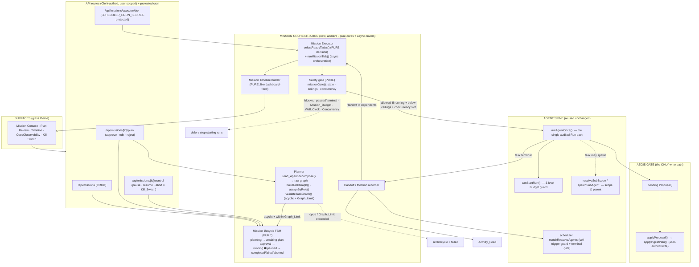
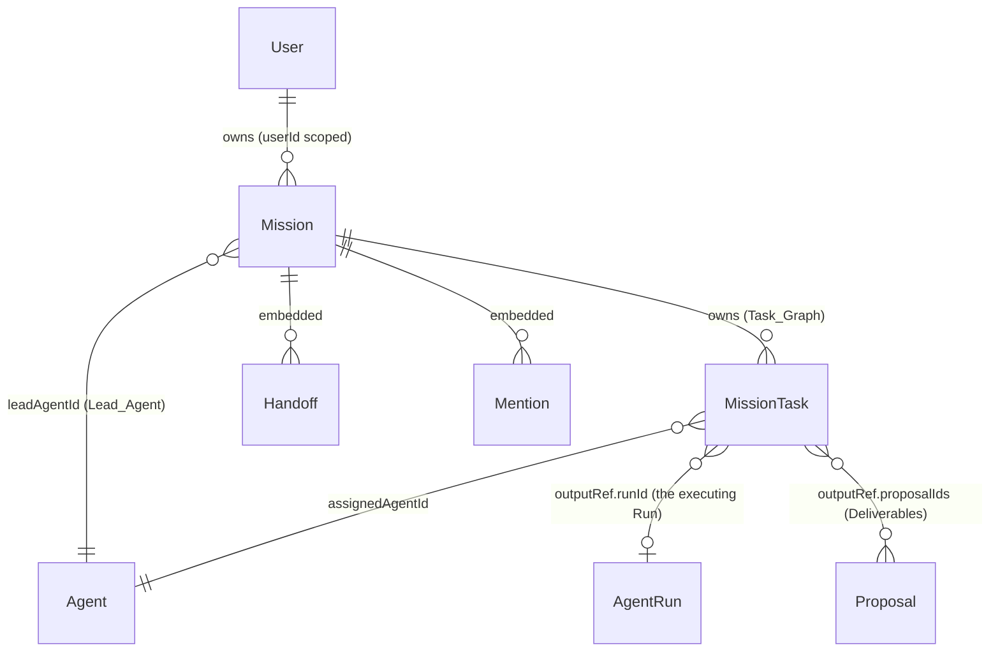

# Design Document — Mission Orchestrator

## Overview

The Mission Orchestrator is the **multi-agent objective layer** that sits on top of
the existing Hermes Agents OS spine. The promise is "*one ask, the squad runs*": a
user states a single high-level Objective, a designated **Lead_Agent** decomposes it
into a dependency-ordered **Task_Graph**, the user approves the plan once, and the
orchestrator then drives the squad to execute the graph task-by-task — each task
running as a normal Agent **Run** that emits **Proposals** the user still signs off on.

This design is **strictly additive and reuses the existing spine without forking it.**
The orchestrator is a coordination layer; it invents no new execution path, no new
write path, and no new budget bypass. Concretely, it builds on these *real* building
blocks already in the repo:

| Existing building block | File | How the Mission Orchestrator reuses it |
|---|---|---|
| `runAgentOnce` — the single audited Run path (budget gate → `AgentRun` → read-only tools → runner emits `DraftProposal`s → persist as pending `Proposal`s → trust/budget bookkeeping) | `src/lib/agents/run-agent.ts` | **Every** Mission_Task executes by calling `runAgentOnce(agent, trigger)`. Missions add no parallel execution path (Req 4.2, 4.8, 12.4). |
| `canStartRun` — the three-level (per-Run / per-Agent / Squad) Budget guard | `src/lib/agents/budget.ts` | Re-used unchanged before every task Run via `runAgentOnce`. The Mission_Budget is a **new fourth ceiling layered on top**, never a replacement (Req 5.5, 5.7). |
| `resolveSubScope` / `spawnSubAgent` — scope ⊆ parent sub-agent spawning | `src/lib/agents/scope.ts`, `src/lib/agents/sub-agent.ts` | Mission sub-tasks that spawn Sub_Agents reuse these verbatim; a mission never widens scope (Req 10.5, 10.6). |
| `tick` / `dueScheduledAgents` / `matchReactiveAgents` — pure scheduler with self-trigger guard + terminal gate | `src/lib/agents/scheduler.ts` | The Mission Executor reuses the **chaining + loop-guard concepts**: a dependent task only chains after the source task's Run reaches a terminal state, and an Agent never chains off its own completion (Req 6.4, 6.5). |
| `transition` — the pure Agent lifecycle FSM | `src/lib/agents/lifecycle.ts` | The new **Mission lifecycle FSM** follows the identical pure-FSM pattern (total, deterministic, invalid moves leave state unchanged) (Req 9). |
| `applyProposal` — the single Aegis write choke point | `src/lib/agents/aegis/apply-proposal.ts` | The **only** way a mission deliverable is realized in the vault. Missions never bypass it (Req 10.1–10.3). |
| `buildActivityFeed` / `deriveNowLine` — pure, I/O-free timeline builders | `src/lib/agents/dashboard-feed.ts` | The **Mission Timeline builder** mirrors this pattern: pure, total, fed already-fetched rows, honest empty state (Req 8). |
| `models.ts` conventions — interface + Schema + `mongoose.models.X || model(...)` export, partial unique indexes | `src/lib/models.ts` | New `Mission` + `MissionTask` models are added the same way, referencing `Agent`/`AgentRun`/`Proposal` by id only (Req 12.1–12.3). |

### The two framings that anchor everything

1. **Propose-never-write is preserved end to end.** A Mission_Task is just an
   `AgentRun`. The runner is structurally incapable of writing knowledge to the vault;
   it emits `DraftProposal`s that `runAgentOnce` persists as `pending` `Proposal`s. The
   only write path remains `applyProposal`, under the user's own Clerk auth. The
   Mission Orchestrator introduces **zero** new unattended write paths.

2. **The plan-approval checkpoint is the one deliberate departure from "agents run
   freely."** An autonomous plan never executes unbounded: the decomposed Task_Graph
   is a reviewable, approvable checkpoint (`awaiting-plan-approval`). No Mission_Task
   Run starts until the user grants an explicit Plan_Approval (Req 3, 9.4). This is the
   single safety gate the mission layer *adds* on top of the existing per-proposal gate.

### Design goals and non-goals

| Goal | How the design meets it |
|---|---|
| One objective → many coordinated deliverables | Lead_Agent decomposes into a Task_Graph; the Executor runs tasks in dependency order |
| Never executes unbounded | Mandatory Plan_Approval checkpoint + Graph/Concurrency/Budget/Wall-Clock limits + Kill_Switch |
| No new write path | Every task Run goes through `runAgentOnce`; every deliverable through `applyProposal` |
| Bounded spend | Existing three-level `canStartRun` + a new Mission_Budget fourth ceiling |
| Structurally loop-proof | Acyclic graph validation + reused scheduler self-trigger guard + terminal gate + run-at-most-once |
| Least privilege | Mission Sub_Agents reuse `resolveSubScope` (scope ⊆ parent) |
| Honest observability | Every timeline/metric derived from real `Run`/`Proposal`/`MissionTask` records; honest zero states |
| Calm, glass UI | Every mission surface uses the `.kiro/steering/glass-theme.md` recipe |

**Non-goals (this spec):** a dedicated always-on worker (the executor tick is driven by
the same interim "protected cron route + opportunistic post-run chaining" approach the
scheduler uses — see §Architecture); the Hermes container runner implementation (it
already plugs in behind `getRunner()`); and any change to existing `Agent` / `AgentRun`
/ `Proposal` fields (additive only, Req 12.3).

## Architecture

The mission layer is a thin orchestration tier **above** the agent spine. It decides
*which task to run next* and *whether a run may start*; the actual run is delegated
down to `runAgentOnce`, and the actual write stays at `applyProposal`. It never reaches
around them.

### Component diagram



### Where the safety limits sit

The five mission safety controls are positioned so that **no Mission_Task Run can start
unless every applicable limit is satisfied**, and they compose with — never replace —
the existing per-Run/Agent/Squad guard:

- **Graph_Limit** (depth + task count) — enforced at the **planning boundary** inside
  `validateTaskGraph`, *before* the mission can ever leave `planning`. An over-limit
  graph sets the mission to `failed` and no task runs (Req 5.1, 5.2). It also bounds
  Sub_Agent nesting depth (Req 6.2, 6.3).
- **Concurrency_Limit** — enforced inside the **pure `selectReadyTasks`** decision: it
  never returns more tasks than the remaining concurrency slots (Req 5.3, 5.4).
- **Mission_Budget** (token *and* cost ceiling) — the **new fourth ceiling**, checked by
  the pure `missionGate` *before* `runAgentOnce`'s own `canStartRun`. Reaching it aborts
  the mission (Req 5.5, 5.6). `canStartRun` still runs inside `runAgentOnce` afterward
  (Req 5.7).
- **Wall_Clock_Limit** — checked by `missionGate` from `mission.startedAt` vs `now`;
  reaching it aborts the mission (Req 5.8, 5.9).
- **Kill_Switch** — the `/control` route drives the FSM to `paused` or `aborted`; both
  are non-running states, so `missionGate` then authorizes no new runs (Req 5.10–5.12).

In all five cases, **already-running task Runs are allowed to finish their in-flight
reporting and carry over unfinished work** via the existing `AgentRun` termination
behavior — the limits stop *starting new* runs, they do not kill in-flight ones
(Req 5.13).

### Execution driving model (honest infra note)

Mirroring the scheduler's documented approach, there is **no in-process timer**. The
executor advances a running mission by a `runMissionTick(missionId)` call driven by:

1. A **protected cron route** `/api/missions/executor/tick` — secured by the same
   `SCHEDULER_CRON_SECRET` + constant-time compare + rate-limit pattern as
   `/api/agents/scheduler/tick`. An external cron hits it on a cadence.
2. **Opportunistic post-run chaining** — after a Mission_Task Run reaches a terminal
   state, the orchestrator re-runs a tick for that mission to start newly-unblocked
   tasks immediately (the reactive Handoff path, gated by the scheduler's terminal gate).

A dedicated long-lived worker is later infrastructure, not a change to this logic — the
decision core (`selectReadyTasks`, `missionGate`, `transition`) is pure and testable now.

## Components and Interfaces

All pure cores live under `src/lib/agents/mission/` and import no Mongoose model, so
they are unit/property-testable without a DB (mirroring `scheduler.ts`, `budget.ts`,
`lifecycle.ts`). The async orchestration and routes do the I/O and delegate decisions
to the pure cores.

### 1. Mission lifecycle FSM (`src/lib/agents/mission/lifecycle.ts`)

A pure, total, deterministic FSM following the exact pattern of
`src/lib/agents/lifecycle.ts` (`transition` + a runnable predicate). It MUST stay in
sync with the `Mission.lifecycle` enum in `models.ts`.

```ts
export type MissionState =
  | 'planning'
  | 'awaiting-plan-approval'
  | 'running'
  | 'paused'
  | 'completed'
  | 'failed'
  | 'aborted'

export const MISSION_STATES: readonly MissionState[] = [
  'planning', 'awaiting-plan-approval', 'running',
  'paused', 'completed', 'failed', 'aborted',
] as const

export const INITIAL_MISSION_STATE: MissionState = 'planning'   // Req 1.1, 9.2

export type MissionEvent =
  | 'decomposed-ok'        // planning → awaiting-plan-approval (acyclic + within Graph_Limit) (Req 9.3)
  | 'decomposition-failed' // planning → failed (cyclic OR Graph_Limit exceeded) (Req 2.7, 5.2, 9.8)
  | 'approve'              // awaiting-plan-approval → running (explicit Plan_Approval) (Req 3.4, 9.4)
  | 'reject'               // awaiting-plan-approval → aborted (Req 3.6)
  | 'pause'                // running → paused (Kill_Switch pause) (Req 5.11, 9.5)
  | 'resume'               // paused → running (Req 9.6)
  | 'complete'             // running → completed (all terminal, ≥1 completed) (Req 9.7)
  | 'abort'                // running|paused → aborted (Kill_Switch abort OR safety ceiling) (Req 5.6, 5.9, 5.12, 9.9)

/**
 * PURE / TOTAL / DETERMINISTIC. For ANY (state, event) returns a valid MissionState:
 *  • a permitted move returns the target state,
 *  • a terminal state (completed|failed|aborted) is absorbing — no event leaves it (Req 9.11),
 *  • any non-permitted (state, event) returns `state` UNCHANGED (Req 9.10),
 *  • never throws, never returns an illegal/undefined state.
 *
 * `approve` is the ONLY edge into `running` from `awaiting-plan-approval`, which makes
 * "no transition to running without an explicit Plan_Approval" an FSM invariant (Req 3.7).
 */
export function transition(state: MissionState, event: MissionEvent): MissionState

/** May the Executor start NEW task Runs for a mission in this state? TRUE iff `running`. */
export function isExecutable(state: MissionState): boolean   // Req 3.1, 9.11
```

The transition table (non-absorbing rows only):

```
planning:                { decomposed-ok → awaiting-plan-approval, decomposition-failed → failed }
awaiting-plan-approval:  { approve → running, reject → aborted }
running:                 { pause → paused, complete → completed, abort → aborted }
paused:                  { resume → running, abort → aborted }
completed | failed | aborted: {}   // absorbing terminal states (Req 9.11)
```

### 2. Planner (`src/lib/agents/mission/planner.ts`)

The Lead_Agent turns the Objective into a Task_Graph. The **model call is isolated**
from the **pure graph logic** so the validation/assignment are PBT targets.

```ts
/** One node the Lead_Agent proposes (pre-assignment, pre-validation). */
export interface RawTask {
  key: string                 // stable within-graph key (e.g. 't1'); LLM- or index-assigned
  description: string
  dependsOn: string[]         // keys of tasks whose output this one needs (Task_Dependency)
  roleHint?: string           // role the Lead_Agent thinks fits (advisory)
}

/** Squad member view the assigner reads (id + role only). */
export interface SquadAgentRef { agentId: string; role: string }

/** A fully-assigned, normalized task ready to persist as a MissionTask. */
export interface PlannedTask {
  key: string
  description: string
  dependsOn: string[]
  assignedAgentId: string     // resolved by role fit; falls back to Lead_Agent (Req 2.4)
  assignmentFallback: boolean // true when assigned to the Lead_Agent as fallback
}

export interface TaskGraph { tasks: PlannedTask[] }

export interface GraphLimits { maxDepth: number; maxTasks: number }   // Graph_Limit (Req 5.1)

export type GraphValidation =
  | { ok: true; depth: number; taskCount: number }
  | { ok: false; reason: 'cycle' }                 // Req 2.7, 6.1
  | { ok: false; reason: 'graph-limit-depth'; depth: number }    // Req 5.2
  | { ok: false; reason: 'graph-limit-count'; taskCount: number } // Req 5.2

// ── Impure: the one model call (kept tiny + injectable for tests) ──────────────
/** Ask the Lead_Agent's model to decompose the Objective into RawTask[]. The ONLY
 *  I/O in the planner; no vault write (planning produces a plan, not knowledge). */
export async function decomposeObjective(
  input: { objective: string; context?: string; squad: SquadAgentRef[]; leadAgentId: string },
  deps: { llm: (prompt: string) => Promise<unknown> },
): Promise<RawTask[]>

// ── PURE: graph construction, assignment, validation (PBT targets) ─────────────
/** Normalize RawTask[] (dedupe keys, drop self/dangling deps) into a graph shape. */
export function buildTaskGraph(raw: RawTask[]): { tasks: Array<Omit<PlannedTask,'assignedAgentId'|'assignmentFallback'>> }

/** Assign every task to a best-fit Squad Agent by role; fallback = Lead_Agent (Req 2.3, 2.4).
 *  TOTAL: every task ends up with exactly one assignedAgentId. */
export function assignByRole(
  tasks: ReturnType<typeof buildTaskGraph>['tasks'],
  squad: SquadAgentRef[],
  leadAgentId: string,
): PlannedTask[]

/** Validate ONLY for cycles (structural DAG check via Kahn topo-sort) and the
 *  Graph_Limit (longest-path depth + task count). Disconnected components PASS
 *  (Req 2.6). PURE / TOTAL — never throws. */
export function validateTaskGraph(graph: TaskGraph, limits: GraphLimits): GraphValidation
```

**Cycle detection** uses Kahn's algorithm (repeatedly remove zero-in-degree nodes); if
any node remains, the graph has a cycle → `{ ok:false, reason:'cycle' }`. **Depth** is
the longest dependency chain (well-defined only on a DAG, so computed after the cycle
check passes). The planning route runs `decomposeObjective → buildTaskGraph →
assignByRole → validateTaskGraph`; on `ok` it persists tasks and fires the FSM
`decomposed-ok`, on failure it records the reason and fires `decomposition-failed`.

### 3. Mission Executor (`src/lib/agents/mission/executor.ts`)

Split into a **pure decision function** (which tasks are ready to run) and the **async
orchestration** that performs the I/O and calls `runAgentOnce`.

```ts
export type TaskStatus = 'pending' | 'running' | 'completed' | 'failed' | 'blocked'

/** The minimal task view the selector reads (a MissionTask doc or a fixture). */
export interface ExecTask {
  key: string
  status: TaskStatus
  dependsOn: string[]
  assignedAgentId: string
}

/** Re-classify a not-yet-started task from its dependencies' statuses. PURE.
 *  • any dependency failed/blocked  → 'blocked' (Req 4.6)
 *  • all dependencies completed     → 'ready'   (Req 4.1)
 *  • otherwise                      → 'waiting' */
export function classifyTask(task: ExecTask, byKey: Map<string, ExecTask>): 'ready' | 'blocked' | 'waiting'

export interface SelectInput {
  tasks: ExecTask[]
  missionState: MissionState
  runningCount: number          // tasks currently 'running'
  concurrencyLimit: number      // Concurrency_Limit (Req 5.3)
  ceiling: MissionCeilingResult // from missionGate ceilings (Req 5.6, 5.9)
}

/**
 * The set of tasks to START right now. PURE / TOTAL / DETERMINISTIC. Guarantees:
 *  1. NEVER returns a task whose status ≠ 'pending'  → run-at-most-once (Req 6.6)
 *  2. NEVER returns a task with an unmet OR failed/blocked dependency (Req 4.1, 4.6)
 *  3. Returns [] unless missionState === 'running'   → no run before approval, none
 *     while paused/terminal (Req 3.1, 9.11)
 *  4. Returns [] when a safety ceiling is reached     (Req 5.6, 5.9)
 *  5. Returns AT MOST (concurrencyLimit − runningCount) tasks, never negative (Req 5.4)
 */
export function selectReadyTasks(input: SelectInput): ExecTask[]

// ── Async orchestration (the I/O layer; delegates every decision to the pure cores) ──
/**
 * Advance one running mission by one tick:
 *   1. load Mission + its MissionTasks (user-scoped) and re-derive accumulated usage
 *   2. evaluate missionGate (state · Mission_Budget · Wall_Clock); abort via FSM if a
 *      ceiling/wall-clock was reached (Req 5.6, 5.9)
 *   3. compute selectReadyTasks(...)
 *   4. for each selected task: load its assigned Agent and execute it through
 *      runAgentOnce(agent, trigger) — the SINGLE audited Run path (Req 4.2, 12.4).
 *      Mark task 'running' → on result, 'completed' | 'failed'; store outputRef
 *      { runId, proposalIds }; accumulate Mission_Budget usage from AgentRun.tokensUsed
 *   5. on each completion, record Handoffs to dependents (Req 4.3, 7.1) and re-classify
 *      newly-blocked tasks (Req 4.6)
 *   6. when every task is terminal, fire FSM 'complete' iff ≥1 completed, else evaluate
 *      failed/aborted (Req 4.7, 9.7)
 * One task's failure never aborts the batch (Req 4.5) — mirrors runAgentOnce's
 * never-throw contract and the scheduler tick's per-agent try/catch.
 */
export async function runMissionTick(missionId: string): Promise<MissionTickResult>
```

`runMissionTick` reuses the scheduler's **terminal gate + self-trigger guard** for the
reactive Handoff step: a dependent task only becomes eligible after the source task's
Run reaches a terminal state (`matchReactiveAgents` semantics, Req 6.5), and a task is
never chained off its own completion (Req 6.4).

### 4. Safety gate + Mission_Budget (`src/lib/agents/mission/limits.ts`)

The **new fourth ceiling**, layered on top of `canStartRun`. Pure and total, like
`budget.ts`.

```ts
export interface MissionBudget {
  tokenCeiling: number          // hard cap on total mission tokens (0/unset = unlimited)
  costCeiling: number           // hard cap on total mission cost   (0/unset = unlimited)
  tokensUsed: number            // accumulated from real AgentRun records (Req 11.2)
  costUsed: number
}

export type MissionCeilingResult =
  | { stop: false }
  | { stop: true; reason: 'mission-token-ceiling' | 'mission-cost-ceiling' | 'wall-clock' }

/** Has the mission hit its OWN ceiling? PURE / TOTAL. Token vs cost is distinguished so
 *  the abort record can name the specific limit type (Req 5.6). Same "0/unset = unlimited"
 *  convention as budget.ts. */
export function missionCeilingReached(
  budget: MissionBudget,
  timing: { startedAt: number; now: number; wallClockLimitMs: number },
): MissionCeilingResult   // Req 5.5, 5.6, 5.8, 5.9

/** The single pre-flight a task Run must pass BEFORE runAgentOnce. PURE / TOTAL.
 *  allowed === true  ⟺  missionState === 'running'
 *                        ∧ missionCeilingReached(...).stop === false
 *                        ∧ runningCount < concurrencyLimit
 *  When allowed, runAgentOnce STILL applies the existing 3-level canStartRun guard
 *  (Req 5.7) — this gate never weakens it, only adds a ceiling on top. */
export function missionGate(input: {
  missionState: MissionState
  budget: MissionBudget
  timing: { startedAt: number; now: number; wallClockLimitMs: number }
  runningCount: number
  concurrencyLimit: number
}): { allowed: boolean; reason?: 'not-running' | 'concurrency-full' | MissionCeilingResult['reason'] }

/** Mission Sub_Agent nesting bound: depth must stay ≤ Graph_Limit depth (Req 6.2, 6.3). */
export function canSpawnSubAgent(currentDepth: number, graphLimitDepth: number): boolean
```

Mission Sub_Agents reuse `resolveSubScope(parent.trustScope, requested)` and
`spawnSubAgent` from `sub-agent.ts` verbatim — the resolved scope is always ⊆ the
assigning Agent's, and the spawned run still emits `pending` Proposals through
`applyProposal` (Req 10.5, 10.6). The Mission Orchestrator adds only the **depth bound**.

### 5. Handoff / Mention recorder (`src/lib/agents/mission/handoffs.ts`)

```ts
export interface Handoff {
  at: string                    // ISO instant
  fromTaskKey: string
  toTaskKey: string
  outputRef: { runId: string; proposalIds: string[] }   // real Run records only (Req 7.5)
}
export interface Mention {
  at: string
  byTaskKey: string; byAgentId: string
  referencedTaskKey: string; referencedAgentId: string
  note: string
}

/** Build the Handoff records produced when `completedTaskKey` finishes: one per
 *  dependent task that depends on it, carrying the completed task's output ref. PURE. */
export function handoffsForCompletion(
  completedTaskKey: string, outputRef: Handoff['outputRef'], tasks: ExecTask[], at: string,
): Handoff[]   // Req 4.3, 7.1
```

Recorded Handoffs/Mentions are persisted on the Mission (additive embedded arrays) and
surfaced as `Activity_Feed` events by reusing the existing feed projection (Req 7.3,
7.4). A dependent task that completes without having received any Handoff input is still
permitted to reach `completed` (Req 4.9) — the recorder records absence, it does not block.

### 6. Mission Timeline builder (`src/lib/agents/mission/timeline.ts`)

Pure, total, I/O-free — the exact shape of `dashboard-feed.ts`'s `buildActivityFeed`.

```ts
export type TimelineSource = 'task-status' | 'handoff' | 'mention'
export interface TimelineEntry {
  id: string
  source: TimelineSource
  at: string                    // ISO; entries are sorted oldest→newest from T+0 (Req 8.1)
  taskKey?: string
  agentId?: string | null
  agentName?: string | null
  status?: TaskStatus
  summary: string
}

export interface TimelineInput {
  missionStartedAt: string | null
  taskTransitions: Array<{ taskKey: string; agentId: string; status: TaskStatus; at: string }>
  handoffs: Handoff[]
  mentions: Mention[]
  agentNames?: Map<string, string> | Record<string, string>
  startedAnyRun: boolean        // false ⇒ honest empty state (Req 8.4)
}

/** Merge real task status transitions + Handoffs + Mentions into one chronological
 *  timeline from T+0. PURE / TOTAL. Returns [] when `startedAnyRun` is false — the
 *  honest empty state, NEVER fabricated activity (Req 8.4, 8.5). */
export function buildMissionTimeline(input: TimelineInput): TimelineEntry[]
```

Per-mission observability (lifecycle state + per-status task counts, accumulated
token/cost, per-Agent contribution, usage-vs-ceiling) is computed by small pure tally
helpers in the same module, all derived from the real `MissionTask` + `AgentRun` records
and honest about zero (Req 11.1–11.6) — the same discipline as
`dashboard-tally`/`dashboard-feed`.

## Data Models

Two **new** collections, added following the exact `models.ts` conventions (TypeScript
interface + `Schema` + `{ timestamps: true }` + hot-reload-safe
`mongoose.models.X || mongoose.model(...)` export + `userId` string index + partial
unique indexes where needed). They reference `Agent` / `AgentRun` / `Proposal` **by id
only** and duplicate none of their data (Req 12.1, 12.2). No existing field on any
existing collection is altered or removed (Req 12.3).

### Model relationship diagram



### `Mission` (NEW collection)

```ts
export interface IMission extends Document {
  userId: string                       // Clerk user (indexed) — owner-only visibility (Req 1.7, 12.5)
  objective: string                    // the user-stated goal (Req 1.1)
  context: string                      // optional user-supplied context for planning (Req 1.2)
  leadAgentId: mongoose.Types.ObjectId // selected or auto-selected Lead_Agent (Req 1.3, 1.4)
  leadAutoSelected: boolean            // true when auto-selected by role fit (Req 1.4, 1.8)

  lifecycle: 'planning' | 'awaiting-plan-approval' | 'running'
           | 'paused' | 'completed' | 'failed' | 'aborted'   // Req 9.1; initial 'planning' (Req 9.2)

  // Safety limits (Graph_Limit lives on the validated graph; the rest are ceilings)
  limits: {
    maxGraphDepth: number              // Graph_Limit depth (Req 5.1)
    maxTaskCount: number               // Graph_Limit count (Req 5.1)
    concurrencyLimit: number           // Concurrency_Limit (Req 5.3)
    tokenCeiling: number               // Mission_Budget token ceiling (Req 5.5); 0 = unlimited
    costCeiling: number                // Mission_Budget cost ceiling  (Req 5.5); 0 = unlimited
    wallClockLimitMs: number           // Wall_Clock_Limit (Req 5.8); 0 = unlimited
  }

  // Accumulated usage — derived from real AgentRun records of this mission's tasks (Req 11.2)
  usage: { tokensUsed: number; costUsed: number }

  // Outcome bookkeeping
  failureReason: string | null         // cycle / graph-limit / ceiling type reached (Req 2.7, 5.2, 5.6)
  ceilingReached: 'mission-token-ceiling' | 'mission-cost-ceiling' | 'wall-clock' | null  // Req 5.6, 5.9

  // Inter-agent collaboration (embedded; surfaced in Activity_Feed + Timeline)
  handoffs: Array<{ at: Date; fromTaskKey: string; toTaskKey: string
                    runId: mongoose.Types.ObjectId; proposalIds: mongoose.Types.ObjectId[] }>  // Req 7.1
  mentions: Array<{ at: Date; byTaskKey: string; byAgentId: mongoose.Types.ObjectId
                    referencedTaskKey: string; referencedAgentId: mongoose.Types.ObjectId; note: string }>  // Req 7.2

  startedAt: Date | null               // set on transition to 'running' (anchors Wall_Clock + Timeline T+0)
  approvedAt: Date | null              // explicit Plan_Approval instant (Req 3.4)
  finishedAt: Date | null
  createdAt: Date
  updatedAt: Date
}
```

Indexes: `{ userId: 1 }` and `{ userId: 1, lifecycle: 1 }` (list + filter by state).

### `MissionTask` (NEW collection)

One node of the Task_Graph. References the executing `AgentRun` and emitted `Proposal`s
**by id** — the deliverables remain in the existing collections (Req 12.2).

```ts
export interface IMissionTask extends Document {
  userId: string                       // owner (indexed, Req 12.5)
  missionId: mongoose.Types.ObjectId   // parent Mission (indexed)
  key: string                          // stable within-graph key (e.g. 't1')
  description: string                  // Req 2.2

  assignedAgentId: mongoose.Types.ObjectId  // best-fit by role; Lead_Agent on fallback (Req 2.3, 2.4)
  assignmentFallback: boolean          // recorded when assigned to Lead_Agent as fallback (Req 2.4)

  dependsOn: string[]                  // keys of Task_Dependencies (DAG edges) (Req 2.5)

  status: 'pending' | 'running' | 'completed' | 'failed' | 'blocked'   // Req 2.2, 4.1, 4.5, 4.6

  // Produced output — a REFERENCE to the originating Run + its emitted Proposals (Req 4.4, 2.2)
  outputRef: { runId: mongoose.Types.ObjectId | null; proposalIds: mongoose.Types.ObjectId[] }

  // Handoff inputs this task received from completed dependencies (Req 4.3, 7.1)
  handoffInputs: Array<{ fromTaskKey: string; runId: mongoose.Types.ObjectId }>

  statusHistory: Array<{ status: string; at: Date }>   // real transition times for the Timeline (Req 8.2, 8.6)
  failureReason: string | null
  createdAt: Date
  updatedAt: Date
}
```

Indexes: `{ userId: 1, missionId: 1 }`, and a partial unique index
`{ missionId: 1, key: 1 }` (unique per mission) to guarantee stable, non-duplicated task
keys within a Task_Graph — the same partial-unique-index discipline used for
`InstalledSkill` and `SupportTicket` in `models.ts`.

### Existing-model usage (additive, non-breaking)

- `Agent` — read for Lead_Agent selection + task assignment; **no field change**. A
  mission task Run is an ordinary `runAgentOnce(agent, …)` call.
- `AgentRun` — each Mission_Task's Run is a normal `AgentRun`; `MissionTask.outputRef.runId`
  points at it. The mission layer reads `tokensUsed` for Mission_Budget accounting. **No
  field change** (the existing `parentRunId` already supports sub-agent runs).
- `Proposal` — deliverables are ordinary `pending` `Proposal`s emitted by `runAgentOnce`;
  `MissionTask.outputRef.proposalIds` references them. They resolve through `applyProposal`
  exactly as today. **No field change.**

Because all linkage is by id and lives on the two new collections, adding missions cannot
break the live agent system (Req 12.1–12.3).

## Correctness Properties

*A property is a characteristic or behavior that should hold true across all valid
executions of a system — essentially, a formal statement about what the system should
do. Properties serve as the bridge between human-readable specifications and
machine-verifiable correctness guarantees.*

PBT **is appropriate** for this feature because the orchestrator's safety core is pure
logic over a large input space: the ready-task selector, the Task_Graph validator, the
Mission lifecycle FSM, the Mission_Budget / Wall_Clock ceiling math, the scope-subset
resolver, and the timeline/tally builders are all deterministic functions with universal
properties (invariants, totality, cardinality bounds, conservation, round-trip
references). The UI surfaces, the LLM decomposition call, the `runAgentOnce` / scheduler
/ `applyProposal` wiring, and the container/secret controls are covered by example,
component, integration, and smoke tests instead (see Testing Strategy). `fast-check` is
already a dev dependency and is used heavily across this codebase.

The prework consolidated the acceptance criteria into the following non-redundant
properties. Each is implemented by a single `fast-check` property test (≥100 iterations).

### Property 1: The ready-task selector never starts an unsafe or premature task

*For any* set of Mission_Tasks, *any* `missionState`, and *any* concurrency/ceiling
inputs, `selectReadyTasks` returns only tasks whose `status` is `pending`, never a task
that has a dependency which is not `completed` (so it never returns a task with an unmet,
failed, or blocked dependency), returns the empty set whenever `missionState` is not
`running` (so no task starts before Plan_Approval, while paused, or in any terminal
state), and returns the empty set whenever a safety ceiling has been reached. Because a
non-`pending` task is never selected, a completed task is never re-executed.

**Validates: Requirements 3.1, 3.6, 4.1, 4.5, 4.6, 5.11, 5.12, 6.6, 9.11**

### Property 2: The Task_Graph validator rejects every cycle and every over-limit graph, and nothing else

*For any* Task_Graph and *any* `GraphLimits`, `validateTaskGraph` returns
`{ ok: false, reason: 'cycle' }` if and only if the graph contains a circular
dependency; for an acyclic graph it returns `{ ok: false, reason: 'graph-limit-depth' }`
or `'graph-limit-count'` exactly when the longest dependency chain exceeds `maxDepth` or
the task count exceeds `maxTasks`; and it returns `{ ok: true }` for every acyclic graph
within both limits — including graphs with disconnected components, which always pass.

**Validates: Requirements 2.5, 2.6, 2.7, 5.1, 5.2, 6.1**

### Property 3: Mission lifecycle transitions are total, gated, and terminal-absorbing

*For any* `MissionState` and *any* `MissionEvent`, `transition` returns a valid
`MissionState` (never an illegal or undefined value); a non-permitted `(state, event)`
pair leaves the state unchanged; the only edge that produces `running` from
`awaiting-plan-approval` is `approve` (so the mission can never reach `running` without
an explicit Plan_Approval); `complete` produces `completed` only from `running`; and the
states `completed`, `failed`, and `aborted` are absorbing — no event moves the mission
out of them.

**Validates: Requirements 2.8, 3.4, 3.5, 3.7, 4.7, 9.1, 9.3, 9.4, 9.5, 9.6, 9.7, 9.8, 9.9, 9.10, 9.11**

### Property 4: A mission stops starting runs exactly when one of its own ceilings is reached

*For any* `MissionBudget` and *any* timing inputs, `missionGate`/`missionCeilingReached`
reports `stop: true` with reason `mission-token-ceiling` when an active token ceiling is
reached (`tokensUsed ≥ tokenCeiling`), `mission-cost-ceiling` when an active cost ceiling
is reached (`costUsed ≥ costCeiling`), and `wall-clock` when the elapsed time
(`now − startedAt`) reaches an active `wallClockLimitMs`; an unset ceiling (`0`/non-finite)
never triggers a stop; and whenever a stop is reported the gate disallows starting a new
run. The reason distinguishes the token ceiling from the cost ceiling.

**Validates: Requirements 5.5, 5.6, 5.8, 5.9**

### Property 5: The concurrency cap is never exceeded

*For any* set of Mission_Tasks, *any* `runningCount`, and *any* `concurrencyLimit`, the
number of tasks returned by `selectReadyTasks` is at most `max(0, concurrencyLimit −
runningCount)`, so the count of simultaneously running Mission_Tasks never exceeds the
Concurrency_Limit.

**Validates: Requirements 5.3, 5.4**

### Property 6: Lead_Agent auto-selection picks an eligible agent independently of validation

*For any* Squad containing at least one Lead-eligible Agent, auto-selection returns an
eligible Agent, and it does so independently of Objective validation and Lead-eligibility
validation — auto-selection proceeds (and yields its result) even when another Mission
creation validation would reject the Mission.

**Validates: Requirements 1.4, 1.8**

### Property 7: Every task is assigned exactly once, with Lead_Agent fallback

*For any* set of tasks, *any* Squad, and *any* Lead_Agent, `assignByRole` returns a
result in which every task has exactly one `assignedAgentId`; a task whose role is
matched by some Squad Agent is assigned to such an agent; and a task with no role-fit
Squad Agent is assigned to the Lead_Agent with `assignmentFallback = true`.

**Validates: Requirements 2.3, 2.4**

### Property 8: Handoffs are recorded for exactly the dependents and carry the real output reference

*For any* completed Mission_Task and *any* task set, `handoffsForCompletion` produces one
Handoff for each task that depends on the completed task and no others, and every produced
Handoff carries the completed task's real output reference (`runId` plus its emitted
`proposalIds`) and names the source and receiving tasks.

**Validates: Requirements 4.3, 7.1, 7.5**

### Property 9: A mission Sub_Agent's scope never exceeds its assigner's scope

*For any* assigning Agent's Trust_Scope and *any* requested Sub_Agent scope, the resolved
mission Sub_Agent scope is a subset of the assigner's: `readableSourceIds` and
`readableCollections` accessible sets ⊆ the parent's, `webAccess` implies the parent had
`webAccess`, and `perRunTokenBudget ≤` the parent's. The mission path never widens scope.

**Validates: Requirements 10.5**

### Property 10: Sub_Agent nesting depth is bounded by the Graph_Limit depth

*For any* current nesting depth and *any* Graph_Limit depth, `canSpawnSubAgent` permits
the spawn if and only if the current depth is strictly less than the Graph_Limit depth,
so a start or spawn that would exceed the depth is refused and one within the depth is not
refused on the basis of the depth limit.

**Validates: Requirements 6.2, 6.3**

### Property 11: Mission task Runs propose, they never write

*For any* Mission_Task executed against an instrumented vault, the number of knowledge
writes performed by the runner is zero; every intended vault alteration appears only as a
`pending` `Proposal`, and a vault knowledge write occurs only as the direct result of
`applyProposal` on an approved Proposal. The Mission Orchestrator introduces no other
write path.

**Validates: Requirements 4.8, 10.1, 10.2, 10.3**

### Property 12: The Mission Timeline is chronological, projection-only, and honest about emptiness

*For any* timeline input, `buildMissionTimeline` returns entries sorted chronologically
from T+0, every returned entry is a projection of a supplied real record (task status
transition, recorded Handoff, or recorded Mention) and none is fabricated, and it returns
the empty set whenever no Mission_Task Run has started, regardless of any other input —
the honest empty state.

**Validates: Requirements 8.1, 8.2, 8.3, 8.4, 8.5, 8.6**

### Property 13: Observability tallies conserve real usage and are honest about zero

*For any* set of the mission's Mission_Task and `AgentRun` records, the per-status task
counts equal the actual tallies, the accumulated token and cost totals equal the sum of
the underlying real run records (no tokens lost or double-counted across the per-Agent
contribution breakdown), and an absence of records yields an all-zero state rather than a
fabricated non-zero value.

**Validates: Requirements 11.1, 11.2, 11.3, 11.4, 11.5, 11.6**

### Property 14: Agent work runs only when all four container controls are enforced

*For any* combination of the four container security controls (non-root user, resource
caps, network isolation, no host Docker socket), the Mission Orchestrator permits Agent
work to execute if and only if all four controls are enforced; if any control cannot be
enforced, the entire Mission fails and no Agent work runs under a partial set of controls.

**Validates: Requirements 12.7**

## Error Handling

| Failure | Detection | Handling | Requirement |
|---|---|---|---|
| **Cyclic Task_Graph produced** | `validateTaskGraph` returns `reason: 'cycle'` | Record `failureReason='cycle'`, fire FSM `decomposition-failed` → `failed`; no Mission_Task Run ever starts (the FSM never reaches `running`). | 2.7, 6.1, 9.8 |
| **Task_Graph exceeds Graph_Limit** | `validateTaskGraph` returns `graph-limit-depth`/`-count` | Record the specific limit in `failureReason`, fire `decomposition-failed` → `failed` before any Run. | 5.2, 9.8 |
| **A single Mission_Task Run fails** | `runAgentOnce` returns `status:'error'` (it never throws) | Mark that task `failed`, store `failureReason`, and continue: `runMissionTick` keeps selecting every other ready task that does not depend on the failed one. One failure never aborts the batch — mirrors the scheduler tick's per-agent `try/catch`. | 4.5 |
| **A task is blocked by a failed dependency** | `classifyTask` sees a `failed`/`blocked` dependency | Mark the dependent `blocked`; the selector never returns it. Its own dependents cascade to `blocked` on subsequent ticks. | 4.6 |
| **Mission_Budget / Wall_Clock ceiling reached** | `missionGate` reports `stop:true` | Stop starting new Runs, record `ceilingReached` (token vs cost vs wall-clock) and fire FSM `abort` → `aborted`. Already-running Runs finish their in-flight reporting and carry over unfinished work via the existing `AgentRun` termination behavior — the ceiling stops *new* starts, it does not kill in-flight Runs. | 5.6, 5.9, 5.13 |
| **Existing 3-level Budget guard refuses a task Run** | `runAgentOnce` returns `status:'blocked'` | The task is not started (left `pending`/deferred); the mission keeps running other tasks. The mission never overrides `canStartRun`. | 5.7 |
| **Kill_Switch during in-flight Runs** | `/control` sets `paused`/`aborted` via FSM | The pure gate then authorizes no new Runs; in-flight Runs report in-progress state and carry over (Req 5.13). | 5.11, 5.12, 5.13 |
| **No eligible Lead_Agent at creation** | creation route finds no Lead-eligible Agent | Reject creation, persist **no** Mission record, return an explicit "an eligible Lead_Agent is required" message. | 1.5 |
| **Empty / whitespace Objective** | creation route validation | Reject with a validation message; auto-selection still runs independently (Req 1.8). | 1.6 |
| **Container controls cannot all be enforced** | provisioner cannot guarantee non-root + caps + isolation + no-socket simultaneously | Fail the entire Mission; never execute Agent work under a partial set of controls (Property 14). | 12.7 |
| **Mission completes with unapproved Proposals** | terminal evaluation | Leave the `pending` Proposals untouched in the Aegis_Queue for the user's later decision — completing a mission neither approves nor discards them. | 10.4 |

Atomicity note: a `runMissionTick` updates each task's status and the mission's
accumulated usage from the **already-persisted** `AgentRun` (the run is the source of
truth for tokens), so a tick that is interrupted and re-run is safe — re-deriving usage
from the run records and re-selecting only `pending` tasks is idempotent (run-at-most-once
is guaranteed by Property 1's `pending`-only selection).

## Testing Strategy

### Dual approach

- **Property-based tests (`fast-check`, ≥100 iterations each)** verify the pure decision
  cores where input variation reveals bugs — Properties 1–14 above. Run under `vitest`
  (`npm test`).
- **Example / component / integration / smoke tests** verify specific behaviors, route
  auth + user-scoping, DOM/ARIA + glass-theme conformance, the `runAgentOnce` /
  `applyProposal` / scheduler wiring, and the container/secret controls.

### Property tests

- One property test per correctness property; each runs `{ numRuns: 100 }` minimum.
- Each test is tagged with a comment referencing this design, in the format:
  `// Feature: mission-orchestrator, Property {N}: {property text}`.
- **Pure targets, tested directly (no I/O), mirroring `scheduler.test.ts` /
  `budget.test.ts` / `lifecycle.test.ts`:** `selectReadyTasks` + `classifyTask` (P1, P5),
  `validateTaskGraph` (P2), the Mission FSM `transition` (P3),
  `missionGate`/`missionCeilingReached` (P4), Lead_Agent auto-selection (P6),
  `assignByRole` (P7), `handoffsForCompletion` (P8), `resolveSubScope` for the mission
  path (P9), `canSpawnSubAgent` (P10), `buildMissionTimeline` (P12), the observability
  tally helpers (P13), and the four-control container predicate (P14).
- **Propose-never-write (P11)** is tested against an **in-memory / spy vault** with a
  stubbed runner so 100+ iterations stay cheap: assert the runner performs zero knowledge
  writes and that the only write path exercised is `applyProposal`. This reuses the
  hermes-agents Property 1 harness shape; the mission path adds no new write capability.

### Testing without a live DB (mirror the repo's mocked-model pattern)

The pure cores import no Mongoose model, so they need no DB at all — the property tests
pass plain fixtures (exactly as `scheduler.ts`/`budget.ts`/`lifecycle.ts` are tested).
For the **route-handler tests**, mirror the repo's established pattern of mocking
`@/lib/mongodb` (`connectDB`) and the `@/lib/models` collections with `vi.mock`, and
mocking `@clerk/nextjs/server`'s `auth()` to inject a `userId` — so creation, plan
approve/edit/reject, control (pause/resume/abort), and the protected executor-tick routes
are tested for auth, user-scoping, validation, and FSM wiring without a real Mongo. The
executor-tick route test also asserts the `SCHEDULER_CRON_SECRET` gate (503 when unset,
401 on mismatch, constant-time compare) exactly as `scheduler/tick/route.test.ts` does.

### Example, component, integration, and smoke tests

- **Example / route (mocked models + Clerk):** Mission creation persists `planning` +
  stores objective/context/lead (Req 1.1–1.4), rejects no-eligible-lead with no record
  (Req 1.5) and empty/whitespace objective (Req 1.6); plan approve/edit/reject drives the
  FSM (Req 3.2–3.6); `/control` pause/resume/abort (Req 5.10); completing a mission leaves
  pending Proposals intact (Req 10.4); user-scoping on every query (Req 1.7, 12.5).
- **Integration (`npm run test:integration`):** a Mission_Task executes through
  `runAgentOnce` (the single audited path) and emits `pending` Proposals (Req 4.2, 4.8,
  12.4); reactive Handoff chaining fires only after the source Run is terminal and never
  off an Agent's own completion, via the reused scheduler guards (Req 6.4, 6.5); a
  spawned mission Sub_Agent routes its write through `applyProposal` (Req 10.6); recorded
  Handoffs/Mentions surface in the Activity_Feed (Req 7.3, 7.4); the redaction logger
  keeps BYO keys/brain tokens out of logs (Req 12.8) and the scoped token mint is bounded
  by Trust_Scope (Req 12.9).
- **Component (jsdom):** every mission surface carries the glass recipe — `sb-dashboard`
  shell + `dash-panel dash-grain dash-interactive` panels, portal overlays using root
  tokens — and the Timeline renders its honest empty state (Req 8.4, 12.10).
- **Smoke / static:** `Mission` + `MissionTask` schemas exist and reference
  `Agent`/`AgentRun`/`Proposal` by `ObjectId` only (Req 12.1, 12.2); no existing field on
  `Agent`/`AgentRun`/`Proposal` is altered or removed — additive only (Req 12.3); the
  provisioner `HostConfig` keeps `CapDrop:['ALL']`, `no-new-privileges`, network isolation,
  and no socket mount for mission container work (Req 12.6).

### Non-breaking gates (must pass before each phase ships)

1. `npm run build` passes.
2. The existing fast suite stays green; new tests are added, never replacing existing ones.
3. The existing `Agent` / `AgentRun` / `Proposal` behavior and the `runAgentOnce`,
   `applyProposal`, `canStartRun`, `resolveSubScope`, and scheduler contracts are
   unchanged — missions consume them, they do not modify them.

## Glass Theme (mission UI surfaces)

Every new mission surface — the **Mission Console** (create + roster of missions), the
**Plan Review** screen (Task_Graph + Assignments + Approve/Edit/Reject), the **Mission
Timeline**, the **Observability / Cost** panel, and the **Kill_Switch** control — MUST
follow the mandatory glass recipe in `.kiro/steering/glass-theme.md`, matching the
dashboard exactly:

- Page wrapper: `<main className="sb-dashboard min-h-full text-[var(--dash-text)]">` so
  the ambient aurora + grid texture backdrop paints.
- Every card/panel carries the full texture stack `dash-panel dash-grain dash-interactive`
  (hero/feature cards add `dash-spotlight` + a `<span className="dash-spotlight-glow" />`
  and wire `useSpotlight()`); a plain `dash-panel` alone reads dull.
- In-scope content uses `--dash-*` tokens only; headings use `.dash-metallic-text`;
  primary buttons (e.g. **Approve Plan**) use `.dash-accent-grad`. Inset wells (the
  Objective input, task rows, stat tiles) use `background: var(--dash-card-solid)` +
  `border: 1px solid var(--dash-border)`.
- **Portalled overlays** (the Kill_Switch confirm dialog, plan-edit menus, tooltips)
  render at `<body>` outside `.sb-dashboard`, so they MUST use **root tokens**
  (`--bg-elev-3` solid background, `--surface-2`, `--border-bright`, `--text-primary`,
  `--accent`, `--shadow-3`) with an always-opaque background — never the `--dash-*` tokens,
  which do not resolve outside the dashboard shell.

The warm accent stays reserved for the review/sign-off state (consistent with the existing
Work_Board accent rule), so the Plan-Approval checkpoint and any awaiting-sign-off
Deliverables read as the moments that want the user's attention.
