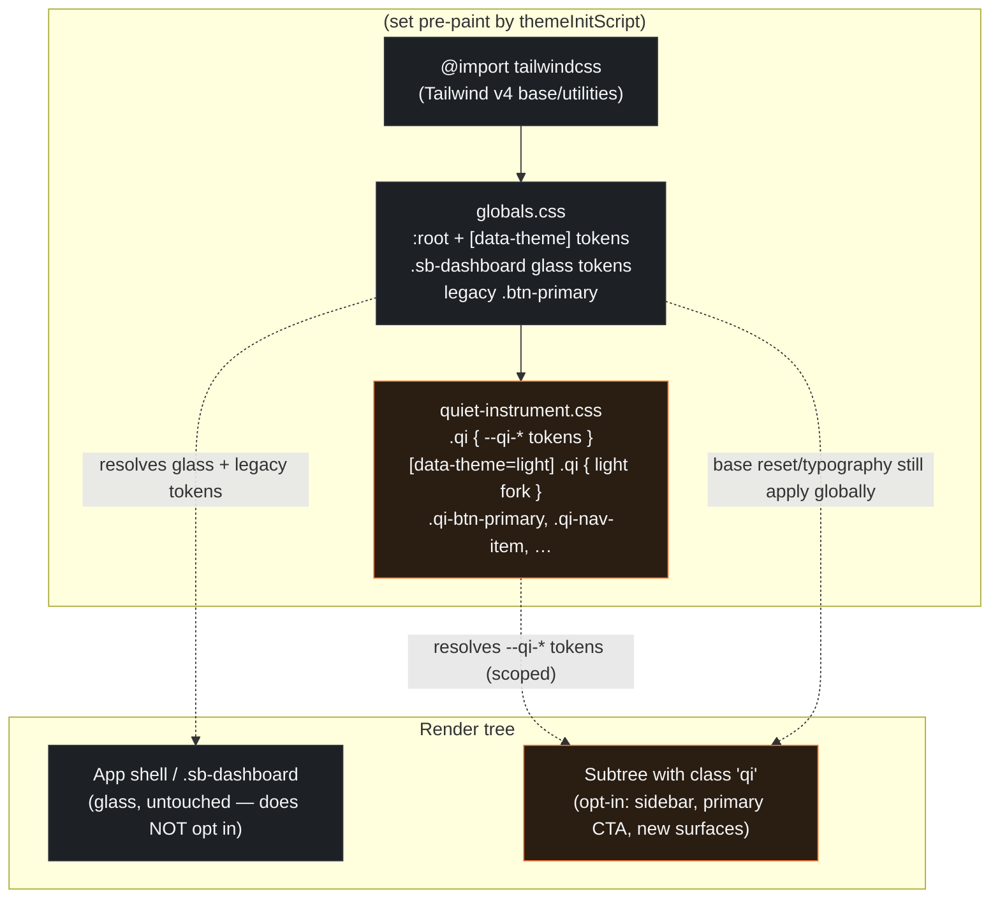

# Design Document — Quiet Instrument Design System (Wave 1)

## Overview

Wave 1 lands the "Quiet Instrument" design-system **foundation** into the live SecondBrain Cloud app (Next.js 16.2.4, App Router, React 19, Tailwind v4) as a **strictly additive, non-breaking** layer. The deliverable is the compiled foundation stylesheet — the Phase 28 artifact provided by the product owner — integrated so that:

1. Every Quiet Instrument token, the Geist / Geist Mono typefaces, the fixed active-nav, the bright primary CTA, and the cool-grey light theme become available.
2. Nothing that ships today (the `.sb-dashboard` glass dashboard, the sidebar, the marketing site) changes appearance or behavior.

The compiled source of truth for all token values and component CSS is:

#[[file:design-system.css]]

This design does **not** re-derive any token value. It specifies **how that file is transformed and integrated** so it composes with the existing `src/app/globals.css` instead of clobbering it.

### The core engineering problem: token + selector collision

The compiled `design-system.css` declares its tokens on a bare global `:root` (and `:root[data-theme="light"]`), defines generic component classes (`.btn`, `.btn-primary`, `.nav-item`, `.badge`, `.input`, …), and ships global element resets (`* { box-sizing }`, `body {}`, `a {}`, `::selection`, and a Google-Fonts `@import`). The existing `globals.css` **already** owns those names. Reading both files, the verified conflicts are:

| Conflict | Existing (`globals.css`) | Compiled (`design-system.css`) | Type |
|---|---|---|---|
| `--surface-2` | `#1a1a1e` (raised glass panel) | `#1D2024` | **Direct token value collision** |
| `--font-mono` | `var()` bound to JetBrains Mono (next/font) | `"Geist Mono","JetBrains Mono",…` | **Direct token collision** |
| `--surface-1`, `--text-1/2/3`, `--border-*`, `--canvas`, `--base`, `--surface-3` | several already used by `.sb-dashboard` / app shell | redefined globally on `:root` | Token shadowing |
| `.btn-primary`, `.btn-ghost` | legacy classes at `globals.css:835+` | redefined | **Direct selector collision** |
| `body {}`, `* {}`, `a {}`, `::selection` | base layer in `globals.css` | global resets | **Global-scope override** |
| `--r-sm/md/lg/xl/full` | existing uses `--radius-*` (no name clash) | `--r-*` | No collision (different names) |
| Geist `@import` from Google Fonts | app uses `next/font` for Inter/JetBrains | runtime `@import url(...)` | Perf + privacy regression |

Requirement 9.6 forbids any token-name collision with `.sb-dashboard` tokens, and Requirement 9.1 forbids removing/renaming them. Requirement 8 requires recording an explicit Surface_Skin decision. The integration strategy below resolves all of this with a **namespace-and-scope** transform plus a **hybrid** Surface_Skin decision.

### Surface_Skin decision (Requirement 8.5) — recorded here, before any implementation

**Decision: `hybrid`.**

Rationale:

- The product owner explicitly approved the warm Apple-silicon **glass** dashboard (`.sb-dashboard`). A `flat` skin (Req 8.4) would repaint every existing surface and discard approved work — high risk, contradicts the "additive, non-breaking" mandate of Requirement 9.
- A pure `glass` skin would forgo the Quiet Instrument foundation entirely, blocking every later wave that composes on these tokens.
- `hybrid` (Req 8.3) keeps the `.sb-dashboard` glass tokens and surfaces **untouched** and introduces the Quiet Instrument foundation as a **namespaced, opt-in layer**. All Aesthetic_Neutral_Discipline rules (Ember scarcity, one-active-nav law, confidence-as-left-edge, Type_Triplet, typography scale, voice registers, honest data, retrieval hierarchy) apply regardless of skin (Req 8.2) and are pure upgrades.
- `hybrid` is the recorded default when nothing is set (Req 8.6), so the decision and the fallback agree — no ambiguity.

Under `hybrid`, Requirement 7 (flat elevation) applies **only to net-new Quiet Instrument surfaces**, never to the retained glass surfaces (Req 8.3). The Surface_Skin value is recorded as a single constant in code (see Data Models) constrained to `{glass, flat, hybrid}` (Req 8.1).

### What Wave 1 ships

- A repo copy of the foundation stylesheet, **transformed** (namespaced tokens, scoped selectors, stripped global resets, removed font `@import`) — `src/styles/quiet-instrument.css`.
- Geist + Geist Mono loaded via `next/font/google` (self-hosted, no Google runtime request).
- The fixed `Sidebar` active-nav (exactly one `aria-current="page"`, three states, rail + mobile, real Inbox badge, responsive breakpoints).
- The fixed "Initialize Ingest" primary CTA using `.qi-btn-primary`.
- The cool-grey light fork of the Quiet Instrument tokens, coexisting with the existing cream `.sb-dashboard` light tokens.

## Architecture

### Integration strategy: namespace + scope + opt-in

Three transforms turn the global compiled file into a safe additive layer:

1. **Namespace every token** with a `--qi-` prefix. `--surface-2` becomes `--qi-surface-2`; `--ember` becomes `--qi-ember`; `--font-sans` becomes `--qi-font-sans`; `--r-md` becomes `--qi-radius-md`; etc. This guarantees no token name equals any existing `globals.css` / `.sb-dashboard` token name (Req 9.6) and makes the source of any value unambiguous.
2. **Scope token declarations** under an opt-in container selector rather than bare `:root`. The Quiet Instrument tokens are declared on `.qi` (and a light fork on `[data-theme="light"] .qi`), not on `:root`. A subtree only receives Quiet Instrument tokens when it (or an ancestor) carries the `qi` class. The live glass dashboard never opts in, so it cannot be reached.
3. **Namespace + scope component classes** (`.btn-primary` → `.qi-btn-primary`, `.nav-item` → `.qi-nav-item`, …) and **drop the global resets** (`* {}`, `body {}`, `a {}`, `::selection`, the font `@import`). Base typography/:root behavior stays owned by `globals.css`.

The `data-theme` attribute already on `<html>` (set pre-paint by `themeInitScript`, toggled by `ThemeProvider`) drives **both** systems coherently: the existing `[data-theme="…"]` blocks resolve the glass tokens, and the new `[data-theme="light"] .qi { … }` block forks the Quiet Instrument tokens. One attribute, two independent token namespaces, zero shared names (Req 1.10, 1.11, 6.8).

> Why a class scope and not just the prefix? The `--qi-` prefix alone satisfies the no-collision rule, but scoping the declarations under `.qi` additionally keeps the global `:root` cascade clean (the live app's `:root` stays exactly as it is today) and makes the new system genuinely **opt-in per subtree** — the safest possible additive posture for a live app. The two techniques are complementary: prefix prevents name clashes, scope prevents cascade reach.

### Load order

Tailwind v4 is imported at the top of `globals.css` via `@import "tailwindcss";`. The Quiet Instrument layer must load **after** the existing token system so that, within a `.qi` subtree, the namespaced tokens are defined, while never overriding `globals.css` base rules (it can't — different names, scoped selectors). Two equivalent options; this design chooses Option A:

- **Option A (chosen): import the QI layer from `globals.css`.** Add `@import "../styles/quiet-instrument.css";` immediately after `@import "tailwindcss";` at the top of `globals.css`. Single stylesheet graph, deterministic order, no change to `layout.tsx` CSS wiring. Tailwind v4's `@import "tailwindcss"` stays first so utility layers and `@theme` resolve correctly.
- Option B (not chosen): import the QI file in `layout.tsx` after `./globals.css`. Works, but splits the CSS source of truth across two files and is more fragile to import-order edits.



### Opt-in surface map for Wave 1

| Surface | Opts into `.qi`? | Skin under hybrid |
|---|---|---|
| `.sb-dashboard` dashboard | No | Glass (retained, untouched) |
| Marketing site | No | Existing styles (untouched) |
| `Sidebar` (`src/components/sidebar.tsx`) | Yes — root `<aside>`, mobile bars get `qi` | QI tokens drive nav states; container chrome may stay glass |
| "Initialize Ingest" button (`src/app/app/ingest/page.tsx`) | The button uses `.qi-btn-primary`; nearest `.qi` ancestor supplies tokens | QI primary button |
| Net-new Quiet Instrument components (later waves) | Yes | Flat per Req 7 |

For Wave 1, the `.qi` class is applied to the sidebar root and the ingest primary button's container so the two fixed components resolve `--qi-*` tokens. The dashboard body is deliberately **not** opted in.

### Font loading architecture (Next.js 16)

Per `AGENTS.md`, the Next.js font API was verified against `node_modules/next/dist/docs/01-app/03-api-reference/02-components/font.md`. Findings:

- `next/font/google` exposes `Geist` and `Geist_Mono` as named imports (verified present in `next/dist/compiled/@next/font/dist/google/font-data.json`). Both are variable fonts.
- `next/font` self-hosts Google fonts at build time — **no browser request to Google**, no layout shift, automatic `size-adjust` fallback metrics. This is strictly better than the compiled file's runtime `@import url('https://fonts.googleapis.com/…')` for performance (eliminates a render-blocking external request) and privacy (no third-party hit).

**Decision: load Geist + Geist Mono via `next/font/google`, drop the `@import` from the compiled file.** The compiled file's `@import url(...Geist...)` line is removed during the transform. The variable-font CSS-variable method (documented "With Tailwind CSS" / "CSS Variables" pattern) is used:

```tsx
// src/app/layout.tsx (illustrative — implementation happens in tasks phase)
import { Geist, Geist_Mono } from 'next/font/google'

const geist = Geist({ subsets: ['latin'], variable: '--font-geist', display: 'swap' })
const geistMono = Geist_Mono({ subsets: ['latin'], variable: '--font-geist-mono', display: 'swap' })
// <html className={`${inter.variable} ${jetbrainsMono.variable} ${geist.variable} ${geistMono.variable} …`}>
```

The QI token file then binds its families to the next/font variables with the spec fallbacks:

```css
.qi {
  --qi-font-sans: var(--font-geist), "Inter", -apple-system, BlinkMacSystemFont, sans-serif;
  --qi-font-mono: var(--font-geist-mono), "JetBrains Mono", ui-monospace, monospace;
}
```

`display: 'swap'` satisfies Requirement 3.7/3.8 (fallback shown while loading and on load failure, text never hidden). The existing Inter / JetBrains next/font variables stay declared so the un-opted-in glass app keeps its current fonts unchanged (Req 9.5). Geist's automatic fallback metrics keep type-scale metrics and layout stable when the fallback renders (Req 3.7).

### Active-nav redesign (maps to `src/components/sidebar.tsx`)

The current `isActiveNav(label, path)` returns active for **all six** wiki-derived items (`Sources, Memory, Topics, People, Decisions, Collections`) whenever `path === '/app/wiki'`, because every one resolves to the same path — this is the "6 orange pills" bug. The redesign:

- **Exactly one active item (Req 4.1, 4.11):** active is computed by best-match against the full `href` (pathname + query), not by a label bucket that collapses six items to one path. A single "winner" is chosen (longest/most-specific match); if the route matches no item, none is active. This makes "where am I?" answerable and prevents multi-active.
- **`aria-current="page"` on the winner only (Req 4.2, 10.5):** replaces the current style-only `active` flag. Rest items carry no `aria-current`.
- **Three states (Req 4.3–4.5)** rendered from `--qi-*` tokens via the `.qi-nav-item` class:
  - Rest: `--qi-text-2`, no Ember.
  - Hover (non-active): L1 resting surface lift + `--qi-text-1`, **no Ember**.
  - Active (`[aria-current="page"]`): `--qi-ember-tint` background + `--qi-text-1` + Ember icon + 3px Ember left bar (`::before`).
- **Rail variant (Req 4.6, 4.7, 11.2):** 240px desktop / 64px rail (`--qi-nav-w` / `--qi-nav-w-rail`). Rail keeps tint + left bar on the active item; labels move to tooltips on hover/focus (Req 4.10).
- **Mobile variant (Req 11.3):** off-canvas drawer hidden by default + persistent bottom tab bar; exactly one item marked `aria-current="page"` with an accessible name (Req 11.4). The existing mobile bottom nav already sets `aria-label`; it gains the single-active law and `aria-current`.
- **Real Inbox badge (Req 4.8, 4.9):** the hardcoded `badge: '12'` is replaced by the real unread count. Badge renders only when count > 0; shows `99+` when count > 99; renders nothing at 0.
- **Responsive breakpoints (Req 11.1–11.3):** >1100px full 240px; 700–1100px inclusive 64px rail; <700px mobile drawer + bottom bar.

### Primary button + "Initialize Ingest" fix

The ingest CTA at `src/app/app/ingest/page.tsx` currently uses an inline `linear-gradient(135deg, var(--accent-bright), var(--accent))` with `disabled:opacity-30`, which reads as muddy/greyed-out (the Phase 1 "looks disabled" bug). It is replaced with the `.qi-btn-primary` class (within a `.qi` scope) which renders Ember background + dark `--qi-ember-ink` label (Req 5.1), 38px height / `--qi-radius-md` (Req 5.2), hover/press/focus-ring/disabled/loading states per Requirement 5, and exactly one `.qi-btn-primary` per view (Req 5.7). The loading state pins the pre-loading pixel width, swaps the label for a spinner, and sets `aria-busy="true"` (Req 5.8, 10.6). In light theme the ink flips to white (Req 6.6).

### Light-theme reconciliation (cool grey, not cream)

Two light themes coexist without conflict because they live in **different token namespaces**:

- Existing cream world: `[data-theme="light"]` + `[data-theme="light"] .sb-dashboard` keep `--bg #fdfaf5`, `--dash-bg #f6f1e7`, etc. — **untouched** (Req 9.1, 9.5).
- New cool-grey world: `[data-theme="light"] .qi { --qi-canvas #F6F7F9; --qi-surface-1 #FFFFFF; … --qi-ember-text #DC5C18; }` per Requirement 6. Only subtrees that opted into `.qi` get cool grey.

Because both forks are keyed off the same `data-theme` attribute, toggling the theme switches both coherently in one operation (the existing `ThemeProvider` effect needs no change). Under `hybrid`, the dashboard stays cream-glass in light mode while QI surfaces render cool grey — intentional and isolated, not a clash.

## Components and Interfaces

### 1. `src/styles/quiet-instrument.css` (new) — the transformed foundation

Derived mechanically from #[[file:design-system.css]] by the transform rules:

- **Tokens:** every custom property renamed `--x` → `--qi-x`; the dark set declared on `.qi`, the light set on `[data-theme="light"] .qi`. Radius tokens `--r-*` → `--qi-radius-*` (Req 1.6). Motion, spacing, color, type, elevation tokens all carried verbatim by value (Req 1.1–1.9).
- **Component classes:** `.btn`→`.qi-btn`, `.btn-primary`→`.qi-btn-primary`, `.btn-secondary/ghost/danger`, `.input`/`.textarea`→`.qi-input`/`.qi-textarea`, `.field-label`→`.qi-field-label`, `.search-bar`, `.filter-chip`, `.kcard`, `.badge`, `.tag`, `.meta`, `.krow`, `.ktable`, `.metric`, `.modal`/`.menu`/`.toast`/`.tooltip`, `.nav-item`→`.qi-nav-item`, `.nav-badge`→`.qi-nav-badge`, `.status-dot`, `.skeleton`, `.empty`. Each rewritten to reference `--qi-*` tokens (Req 1.12 — token at every point of use, no literals).
- **Stripped:** the `@import url(Geist)` line, the global `* { box-sizing }`, `body { … }`, `a { … }`, and `::selection` rules. (`.skip-link`/`.sr-only` are kept but prefixed `.qi-skip-link`/`.qi-sr-only` to avoid touching any existing global helpers.)
- **Reduced motion:** the `@media (prefers-reduced-motion:reduce)` block is retained but scoped to `.qi` descendants, and additionally sets the four duration tokens to `0ms` (Req 2.1) while preserving end states (Req 2.2) and converting loops (e.g. `.status-dot` pulse, `.skeleton` shimmer) to a single static state (Req 2.3).

Wave 1 only **wires up** the token block, typography, `.qi-btn-*`, and `.qi-nav-*`. The remaining component classes ship in the file (foundation) but are exercised by later waves; including them now is what makes this a "foundation token file" (Req 1).

### 2. `src/components/sidebar.tsx` (modified) — active-nav

Interface changes (no prop signature change to `Sidebar`):

- Add a pure helper `resolveActiveHref(pathname, search, navItems): string | null` returning the single best-matching item key (or `null`). This replaces the label-bucket `isActiveNav`. It is the unit under test for the single-active law.
- Each desktop/rail/mobile item renders `aria-current={isWinner ? 'page' : undefined}` and the `.qi-nav-item` class; the root `<aside>` and mobile bars gain `qi`.
- Inbox badge reads a real `unreadCount` (see Data Models) and renders via `.qi-nav-badge` with the `99+` rule; omitted when 0.

### 3. `src/app/app/ingest/page.tsx` (modified) — primary CTA

The submit `<button>` adopts `.qi-btn-primary` and the loading/disabled contract from Requirement 5. A `.qi` scope wraps the form region so tokens resolve.

### 4. `src/app/layout.tsx` (modified) — fonts

Adds `Geist` + `Geist_Mono` next/font variables to `<html className>` alongside the existing Inter/JetBrains variables. No other change.

### 5. `src/app/globals.css` (modified) — one import line

Adds `@import "../styles/quiet-instrument.css";` after `@import "tailwindcss";`. The legacy `.btn-primary`/`.btn-ghost` at line 835 are left intact (Req 9.1, 9.4) — the new button is `.qi-btn-primary`, a different name, so no collision.

## Data Models

These are small, code-level models (TypeScript) — Wave 1 introduces no database schema.

### Surface_Skin constant (Req 8.1, 8.5, 8.6)

```ts
// src/styles/design-system.ts
export type SurfaceSkin = 'glass' | 'flat' | 'hybrid'
/** Recorded Wave 1 decision. See design.md §Surface_Skin decision. */
export const SURFACE_SKIN: SurfaceSkin = 'hybrid'
```

Constrained to the three-value union (Req 8.1); default/fallback semantics are encoded by it being a constant set to `hybrid` (Req 8.6).

### Navigation item model (active-nav)

```ts
type NavItem = {
  href: string          // full target incl. query, e.g. '/app/wiki?type=concept'
  label: string         // accessible name (mobile/rail tooltip)
  icon: LucideIcon
  matchKey: string      // stable identity used for the single-active winner
  showBadge?: boolean   // Inbox only
}
// Active resolution: exactly one winner or null.
function resolveActiveHref(pathname: string, search: string, items: NavItem[]): string | null
```

Invariant: `resolveActiveHref` returns at most one key; when it returns a key, exactly that item is marked `aria-current="page"`.

### Inbox unread count (Req 4.8, 4.9)

```ts
// Real count source (Wave 1 may read from existing inbox/ingest queue count).
type InboxBadge = { count: number }            // count >= 0
function formatBadge(count: number): string | null // 0 -> null, >99 -> '99+', else String(count)
```

### Token namespace map (transform contract)

```
design-system.css name  ->  quiet-instrument.css name (scoped to .qi)
--canvas                 ->  --qi-canvas
--surface-1/2/3          ->  --qi-surface-1/2/3      (resolves the --surface-2 collision)
--text-1/2/3             ->  --qi-text-1/2/3
--border-subtle/...      ->  --qi-border-subtle/...
--ember, --ember-*       ->  --qi-ember, --qi-ember-*
--type-*                 ->  --qi-type-*
--space-1..8             ->  --qi-space-1..8
--r-sm/md/lg/xl/full     ->  --qi-radius-sm/md/lg/xl/full
--font-sans/mono         ->  --qi-font-sans/mono     (resolves --font-mono collision)
--t-instant/fast/base/slow, --ease-* -> --qi-* (same)
--error, --error-ring    ->  --qi-error, --qi-error-ring
```

Contract: the set of emitted `--qi-*` names ∩ the set of existing `globals.css` names = ∅ (Req 9.6).

## Correctness Properties

*A property is a characteristic or behavior that should hold true across all valid executions of a system — essentially, a formal statement about what the system should do. Properties serve as the bridge between human-readable specifications and machine-verifiable correctness guarantees.*

The Wave 1 surface is mostly CSS tokens, font wiring, and styled components — much of which is verified by snapshot/integration/manual contrast checks rather than property tests. However, a meaningful subset is pure logic over a large/varied input space and is well suited to property-based testing: the **token-namespace collision invariant**, the **single-active-nav resolver**, and the **Inbox badge formatter**. These properties are written below; the prework analysis that classified every acceptance criterion precedes them in context.

### Property 1: No Quiet Instrument token name collides with an existing token

*For any* token name emitted by `quiet-instrument.css` and *any* token name declared in `globals.css` (including `.sb-dashboard` blocks), the two sets are disjoint — no QI token name equals any existing token name.

**Validates: Requirements 9.6, 1.12**

### Property 2: Exactly one active navigation item

*For any* pathname + query string and *any* navigation item list, `resolveActiveHref` marks at most one item as the winner; and when any item's `href` matches the current location, exactly one item is the winner and every other item is non-active (no `aria-current`).

**Validates: Requirements 4.1, 4.2, 4.11, 10.5, 11.4**

### Property 3: Inbox badge reflects the real count with the 99+ rule

*For any* non-negative integer unread count `n`, `formatBadge(n)` returns `null` when `n` is 0, the string `"99+"` when `n > 99`, and the decimal string of `n` otherwise — so the badge renders nothing at 0, the true count in range, and `99+` above 99.

**Validates: Requirements 4.8, 4.9**

### Property 4: Cool-neutral ramp is monotonic and cool at every step

*For any* two adjacent steps of the 12-step neutral ramp, lightness strictly increases from the darker to the lighter step, and at every step the blue channel is greater than or equal to the red channel (the ramp is cool, never warm/cream).

**Validates: Requirements 1.1**

### Property 5: Reduced motion zeroes durations while preserving end state

*For any* Quiet Instrument motion duration token, when Reduced_Motion_Mode is active the resolved duration is `0ms`, and the computed end-state styling of any transition is identical to its end state when Reduced_Motion_Mode is inactive (no state cue is lost).

**Validates: Requirements 2.1, 2.2, 2.3**

## Error Handling

- **Font load failure / slow load (Req 3.7, 3.8):** `display: 'swap'` renders the declared fallback (Inter for sans, JetBrains Mono for mono) immediately and on failure; next/font's `adjustFontFallback` keeps metrics stable so layout does not shift. Text is never hidden.
- **Unknown / missing `data-theme` (Req 1.11):** the dark token set is the default — QI dark tokens are declared on `.qi` unconditionally and only the light fork is gated on `[data-theme="light"] .qi`. Any value other than `light` (including absent or garbage) yields dark.
- **Route matches no nav item (Req 4.11):** `resolveActiveHref` returns `null`; no item gets `aria-current="page"`. The UI shows no active pill rather than guessing.
- **Primary button activated while disabled/loading (Req 5.9):** the handler early-returns; `disabled`/`aria-disabled` and `aria-busy` gate the action so neither pointer nor keyboard activation triggers it, and state is preserved.
- **Inbox count unavailable (data source error):** treat as `0` → no badge (fail quiet, never render a fake number — consistent with the "honest data" discipline).
- **Missing `.qi` scope on a `.qi-*` component:** the component falls back to inherited/`globals.css` values rather than erroring (CSS custom properties resolve to initial/inherited). Wave 1 guarantees a `.qi` ancestor on the two shipped components; this is covered by integration tests.

## Testing Strategy

The goal is twofold: **prove non-breaking** (Req 9) and **verify the new component states** (Req 4, 5, 6, 10, 11). PBT applies only to the pure-logic subset (Properties 1–5); everything else uses example-based unit, integration, snapshot, and manual a11y checks.

### Proving non-breaking (Requirement 9)

- **Build gate:** `npm run build` must pass with no new errors/warnings attributable to Wave 1 (Req 9.3). Run before/after.
- **Existing test suite:** `npm test` (vitest, `environment: node`) must remain fully green — every test that passed before Wave 1 still passes (Req 9.7). The existing suites (`utils.test.ts`, `auto-link.test.ts`, `catalog.test.ts`) are unaffected by CSS/font changes.
- **Token-collision test (Property 1):** a unit test parses both `globals.css` and `quiet-instrument.css`, extracts declared custom-property names, and asserts the intersection is empty (Req 9.6) and that `.sb-dashboard` token names are all still present and unchanged in `globals.css` (Req 9.1, 9.4).
- **Glass-dashboard visual regression:** snapshot the compiled `.sb-dashboard` rule set (or a rendered dashboard screenshot via the existing `gstack browse`/QA tooling) before/after; assert no diff (Req 9.5, 9.2). Manual smoke: dashboard, sidebar, marketing render with no console errors.

### Verifying new component behavior

- **Active-nav (example + property):** unit tests for `resolveActiveHref` across the real `nav` list — dashboard, query, ingest, the six `/app/wiki?*` variants, graph hash, agent — asserting exactly one or zero winners (Property 2). Component/DOM tests (jsdom — added as a second vitest project or `@vitest/browser`, since the default env is `node`) assert exactly one `aria-current="page"` per route, the three visual states, rail tooltips, and mobile single-active.
- **Primary button (example):** tests for hover/press/focus-ring/disabled/loading classes and ARIA — `aria-busy="true"` while loading, width pinned, action suppressed when disabled/loading (Req 5, 10.6), keyboard Enter/Space parity (Req 10.7).
- **Badge formatter (property):** Property 3 over random non-negative integers.
- **Light theme (example + property):** assert the `[data-theme="light"] .qi` fork resolves the Req 6 values and that DOM/layout/spacing/radius/type tokens are identical between themes, differing only in color (Req 6.8). Property 4 guards the ramp.
- **Reduced motion (example):** assert the scoped media block zeroes the four duration tokens and that `.status-dot`/`.skeleton` collapse to a static state (Property 5, Req 2).
- **Accessibility (manual + automated):** contrast ratios for text/large-text/non-text in both themes (Req 10.1) computed from token values in a unit test where feasible; keyboard focus order and reachability (Req 10.5, 10.7) via component tests; icon+label+color redundancy for Type_Triplet and confidence edge (Req 10.2, 10.3) asserted structurally. Full WCAG AA conformance requires manual testing with assistive technology and expert review — automated checks are necessary but not sufficient.

### Property-based testing setup

- **Library:** `fast-check` with vitest (TypeScript ecosystem standard; do not hand-roll generators).
- **Iterations:** each property test runs **≥ 100** iterations (`fc.assert(fc.property(...), { numRuns: 100 })`).
- **Tagging:** each property test is tagged with a comment referencing this document, format:
  `// Feature: quiet-instrument-design-system, Property N: <property text>`
- **Mapping:** one property-based test per correctness property (Properties 1–5). CSS-parsing properties (1, 4, 5) read the actual stylesheet files so the test verifies the shipped artifact, not a copy.

### Test pyramid summary

| Concern | Test type | Why |
|---|---|---|
| Token collision, ramp, reduced-motion durations | Property (fast-check) | Logic over varied inputs / full token set |
| Active-nav resolver, badge formatter | Property (fast-check) | Pure functions, large input space |
| `aria-current`, button states, tooltips, mobile | Example (component, jsdom) | Specific DOM/ARIA assertions |
| Light-theme token values, font wiring | Example (unit) | Concrete value checks |
| Build passes, existing suite green | Smoke / regression | Non-breaking guarantee (Req 9.3, 9.7) |
| Glass dashboard unchanged | Snapshot / visual | Non-breaking guarantee (Req 9.5) |
| WCAG AA | Manual + automated assist | Conformance needs human verification |
